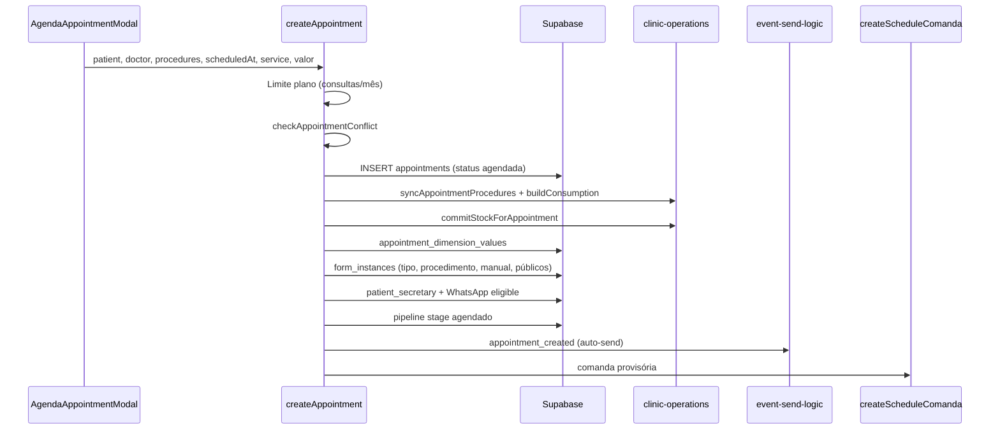
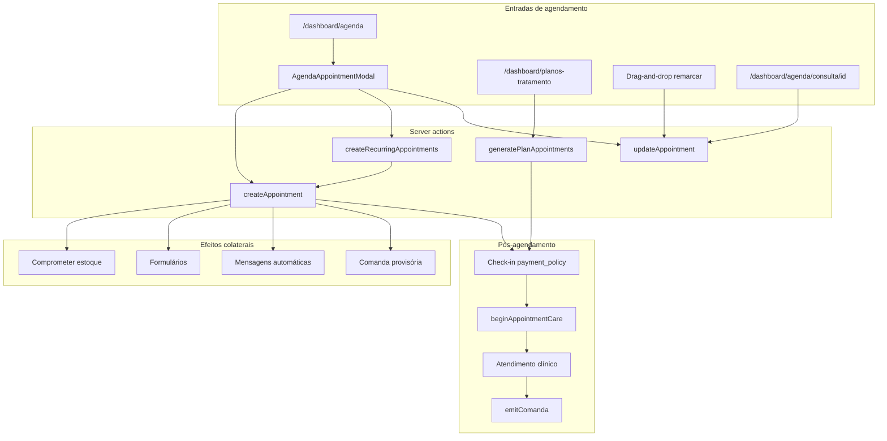

# Agendamento — mapa operacional e lacunas

Documento de referência sobre **como o agendamento funciona hoje** no Flowmedi: entradas de UI, server actions, modelo de dados, integrações e pontos de melhoria.

Complementa [`FLUXO-OPERACIONAL-COMPLETO.md`](FLUXO-OPERACIONAL-COMPLETO.md) (jornada agenda → atendimento → cupom) e [`FLUXO-OPERACIONAL-V2-STATUS.md`](FLUXO-OPERACIONAL-V2-STATUS.md) (status v2).

**Última atualização:** 2026-06-05 (análise do código em `main`)

---

## Índice

1. [Resumo executivo](#1-resumo-executivo)
2. [Glossário](#2-glossário)
3. [Modelo de dados](#3-modelo-de-dados)
4. [Entradas de agendamento](#4-entradas-de-agendamento)
5. [Fluxo principal — consulta avulsa](#5-fluxo-principal--consulta-avulsa)
6. [Recorrência e planos multi-sessão](#6-recorrência-e-planos-multi-sessão)
7. [Regras de horário e conflito](#7-regras-de-horário-e-conflito)
8. [Pós-agendamento (operacional)](#8-pós-agendamento-operacional)
9. [Papéis, permissões e visibilidade](#9-papéis-permissões-e-visibilidade)
10. [Integrações automáticas](#10-integrações-automáticas)
11. [Diagrama de fluxo](#11-diagrama-de-fluxo)
12. [Lacunas e melhorias](#12-lacunas-e-melhorias)
13. [Apêndice — arquivos principais](#13-apêndice--arquivos-principais)

---

## 1. Resumo executivo

O agendamento é **interno** (equipe da clínica). Não há portal público de autoagendamento pelo paciente.

**Caminho feliz (consulta avulsa):**

1. Secretária/admin abre `/dashboard/agenda` → modal **Nova consulta** (`AgendaAppointmentModal`).
2. Preenche paciente, profissional, procedimento(s), data/hora e financeiro (serviço + dimensões de preço).
3. `createAppointment` valida plano, conflitos, persiste `appointments`, compromete estoque, cria formulários, dispara mensagens e gera comanda provisória.
4. No dia da consulta: check-in (política de pagamento) → atender → clínico → cupom → caixa.

**Três formas de criar consultas:**

| Forma | Action | Uso típico |
|-------|--------|------------|
| Avulsa | `createAppointment` | Uma consulta na agenda |
| Série recorrente | `createRecurringAppointments` | 2–52 sessões (semanal/quinzenal/mensal) |
| Sessões de plano | `generatePlanAppointments` | Consultas vinculadas a `treatment_plans` já existente |

---

## 2. Glossário

| Termo | Significado |
|-------|-------------|
| **Consulta / appointment** | Registro em `appointments` com `scheduled_at` e `status` |
| **Tipo de consulta** | `appointment_types` — define duração (`duration_minutes`) para conflito de horário |
| **Procedimento** | `procedures` — obrigatório no modal; pode haver vários via `appointment_procedures` |
| **Serviço** | `services` — base de cobrança; resolvido pelo procedimento ou escolha manual |
| **Dimensões de preço** | `dimension_values` ligados à consulta em `appointment_dimension_values` |
| **Comprometido** | Reserva de estoque ao agendar (`commitStockForAppointment`) |
| **Comanda provisória** | `comandas` com `issued_at = null`, criada no agendamento (`createScheduleComanda`) |
| **Série / recorrência** | Consultas com mesmo `recurrence_group_id` e `session_number` |
| **Plano de tratamento** | `treatment_plans` — pacote financeiro; consultas filhas com `treatment_plan_id` |
| **Check-in** | Definição de `payment_policy` no dia (`antecipado` \| `no_dia` \| `pos_atendimento`) |

### Status da consulta

| Status | Significado operacional |
|--------|-------------------------|
| `agendada` | Criada; padrão ao agendar |
| `confirmada` | Confirmação manual (admin/secretaria) |
| `realizada` | Atendimento concluído (manual ou após fluxo clínico) |
| `falta` | No-show; libera estoque comprometido |
| `cancelada` | Cancelada; libera estoque; some da agenda (filtro `neq cancelada`) |

Transição para atendimento: `startAppointmentConsultation` / `beginAppointmentCare` exige `agendada` ou `confirmada`.

---

## 3. Modelo de dados

### Tabela `appointments` (campos relevantes)

| Campo | Origem / uso |
|-------|----------------|
| `clinic_id`, `patient_id`, `doctor_id` | Obrigatórios no fluxo principal |
| `appointment_type_id` | Opcional; duração para conflitos (default 30 min) |
| `procedure_id` | Legado; primeiro procedimento da lista |
| `service_id`, `valor` | Cobrança prevista no agendamento |
| `scheduled_at` | Data/hora da consulta |
| `status` | Ciclo de vida (ver acima) |
| `payment_policy` | Preenchido no check-in, não no agendamento |
| `treatment_plan_id`, `session_number` | Multi-sessão / plano |
| `recurrence_group_id` | Agrupa série recorrente |
| `started_at`, `completed_at`, `duration_minutes` | Timer do atendimento |
| `notes`, `recommendations`, `preparation_notes`, etc. | Orientações ao paciente |
| `created_by` | Quem agendou |

### Tabelas relacionadas

| Tabela | Relação |
|--------|---------|
| `appointment_procedures` | N procedimentos por consulta |
| `appointment_dimension_values` | Dimensões de preço selecionadas |
| `appointment_consumption_lines` | BOM / insumos previstos |
| `appointment_stock_lots` | Alocação FEFO de lotes (pós-migration v2) |
| `form_instances` | Formulários por tipo, procedimento ou vínculo manual |
| `comandas` | Cupom provisório ou emitido |
| `encounters` | Atendimento clínico |
| `event_timeline` | Eventos para WhatsApp/e-mail automáticos |

---

## 4. Entradas de agendamento

### 4.1 Agenda principal — `/dashboard/agenda`

- **Server:** `app/dashboard/agenda/page.tsx` carrega ~4 meses de consultas (1 mês atrás + 3 à frente), pacientes, médicos, tipos, procedimentos, serviços, dimensões de preço.
- **Client:** `agenda-client.tsx` — visualizações timeline (dia/semana/mês) e calendário (semana/mês), filtros, drag-and-drop para remarcar.
- **Criação:** botão **Nova consulta** → `AgendaAppointmentModal`.
- **Edição:** sidebar/modal de detalhes ou modal em modo `edit` → `getAppointmentForEdit` + `updateAppointment`.
- **Remarcação rápida:** arrastar evento → `updateAppointment({ scheduled_at })` com validação de conflito.

### 4.2 Modal Nova/Editar consulta — `agenda-appointment-modal.tsx`

Abas:

| Aba | Conteúdo |
|-----|----------|
| Dados básicos | Paciente*, profissional*, tipo de consulta, notas, formulários opcionais |
| Procedimentos | Um ou mais procedimentos*; filtra por `doctor_procedures` se configurado |
| Data e hora | Data, horário, recorrência (2–52 sessões, frequência, overrides por sessão) |
| Financeiro | Serviço, dimensões, preview (`getAppointmentChargePreview`) |

Validações no submit:

- Paciente e profissional obrigatórios.
- Pelo menos um procedimento.
- Serviço obrigatório (exceto recorrência sem cobrança por sessão/plano).
- Recorrência ativa → `createRecurringAppointments`; senão → `createAppointment` ou `updateAppointment`.

### 4.3 Página da consulta — `/dashboard/agenda/consulta/[id]`

- **Reagendar:** `DataHoraReagendar` → `updateAppointment`.
- **Agendar retorno:** mesma action, mas em consulta `realizada` troca `appointment_type_id` para tipo com `slug = retorno` (não cria nova consulta).
- **Status:** `consulta-detalhe-client.tsx` — admin/secretaria alteram status manualmente.
- **Série:** `RecurrenceSeriesButton` → reagendar/cancelar sessões da série.

### 4.4 Planos de tratamento — `/dashboard/planos-tratamento`

- Criação de plano: `treatment-plan-actions.ts`.
- Agendar sessões do plano: `generatePlanAppointments` — lista de slots com data/hora e médico opcional.
- Recorrência na criação de plano: wizard gera datas e chama o mesmo fluxo.

### 4.5 Outros gatilhos indiretos

- **CRM pipeline:** ao agendar, paciente em estágio `cadastrado` no `non_registered_pipeline` passa para `agendado`.
- **Não há** agendamento via WhatsApp, API pública ou link para o paciente.

---

## 5. Fluxo principal — consulta avulsa

**Action:** `createAppointment` em `app/dashboard/agenda/actions.ts`

### Detalhamento por etapa

| # | Etapa | Comportamento |
|---|--------|---------------|
| 1 | Autenticação | Usuário logado com `clinic_id` |
| 2 | Limite do plano | `canCreateAppointment` — máximo de consultas/mês do plano SaaS |
| 3 | Conflito | Mesmo médico + sobreposição de intervalos; limite clínico `agenda_max_concurrent` |
| 4 | Persistência | `status = agendada`, `created_by = user.id` |
| 5 | Procedimentos | `syncAppointmentProcedures` + linhas de consumo (BOM) |
| 6 | Estoque | `commitStockForAppointment` (erro não impede criação — só log) |
| 7 | Preço | `valor` e `service_id` gravados; dimensões em tabela pivô |
| 8 | Formulários | Auto por `appointment_type_id`, `form_template_procedures`, seleção manual; reutiliza respostas públicas por e-mail |
| 9 | Secretária | `patient_secretary` + vínculo conversa WhatsApp ao pool da secretária |
| 10 | Auditoria | `appointment_created` em audit log |
| 11 | Mensagens | Trigger DB `appointment_created` → `runAutoSendForEvent` (WhatsApp/e-mail) |
| 12 | Financeiro | `createScheduleComanda` — comanda `aberta`, `issued_at` null, se houver serviço/valor |

### Edição — `updateAppointment`

- Remarcação ou troca de médico/tipo → revalida conflito.
- Troca de procedimentos → libera e recompromete estoque (se status permitir).
- `cancelada` / `falta` → `releaseStockForAppointment`; recalcula `sessions_used` do plano se aplicável.
- Mudança de `scheduled_at` → evento `appointment_rescheduled` + mensagem automática.
- Mudança de `status` → eventos `appointment_confirmed`, `appointment_completed`, etc.

---

## 6. Recorrência e planos multi-sessão

### 6.1 Recorrência na agenda (`createRecurringAppointments`)

- Ativada no modal (aba Data) quando `recurrence.enabled`.
- Gera slots com `buildRecurrenceSessionSlots` (`lib/recurrence-schedule.ts`).
- Todas as sessões compartilham `recurrence_group_id` (UUID novo).
- **`skipConflictCheck: true`** — conflitos só avisados via `checkRecurrenceSlotsConflicts` na UI, não bloqueiam.
- Formulários vinculados manualmente só na **primeira** sessão.
- Modo de cobrança do serviço (`services.recurrence_billing_mode`):
  - `per_session` → valor por sessão (Modelo A).
  - `treatment_plan` → cria `treatment_plans` + valor rateado por sessão (Modelo B).
  - Sem modo / null → só agenda, sem exigir serviço na recorrência.

**Gestão da série:** `recurrence-actions.ts` — listar, reagendar sessão, cancelar uma, cancelar futuras, adicionar sessão ao fim.

### 6.2 Planos de tratamento (`generatePlanAppointments`)

- Chamado a partir de `/dashboard/planos-tratamento`.
- Insere diretamente em `appointments` ( **não** passa por `createAppointment` ).
- Define `treatment_plan_id`, `session_number`, `payment_policy` derivada do plano.
- Médico e serviço opcionais no slot.

**Diferenças importantes em relação ao fluxo avulso:**

| Capacidade | `createAppointment` | `generatePlanAppointments` |
|------------|---------------------|----------------------------|
| Validação de conflito | Sim | Não |
| Procedimentos / BOM | Sim | Não |
| Compromisso de estoque | Sim | Não |
| Formulários automáticos | Sim | Não |
| Comanda provisória | Sim | Não |
| Mensagem appointment_created | Sim | Não |
| Limite consultas/mês | Sim | Não |

---

## 7. Regras de horário e conflito

### Configuração da clínica (`clinics`)

| Campo | Efeito |
|-------|--------|
| `agenda_work_start` / `agenda_work_end` | Horário exibido na grade da agenda (default 7h–20h) |
| `agenda_max_concurrent` | Máximo de consultas simultâneas na clínica (≥2 ativa a regra) |

### Detecção de conflito (`checkAppointmentConflict`)

1. **Por profissional:** busca consultas do médico no mesmo dia (exceto `cancelada`); calcula fim do slot com `appointment_types.duration_minutes` (default 30 min); detecta sobreposição.
2. **Por clínica:** se `agenda_max_concurrent` definido, conta quantas consultas (todos os médicos) se sobrepõem ao novo slot.

### O que **não** é validado hoje

- Horário dentro de `agenda_work_start/end` (só visual).
- Disponibilidade individual do médico (folgas, bloqueios).
- Feriados ou salas/consultórios específicos.
- Duração quando `appointment_type_id` é null (usa 30 min fixo).

---

## 8. Pós-agendamento (operacional)

O agendamento é o **primeiro elo** da cadeia documentada em `FLUXO-OPERACIONAL-COMPLETO.md`.

| Fase | Onde | Action principal |
|------|------|------------------|
| Fila do dia | `/dashboard/atendimento` | Lista consultas próximas com badge operacional |
| Check-in | Aba Operacional da consulta | `setAppointmentPaymentPolicy` |
| Atender | Botão Atender | `beginAppointmentCare` → `started_at` + `encounter` |
| Clínico | `/dashboard/agenda/atendimento/[id]` | Fichas + `finishClinicalEncounter` |
| Cupom | Operacional / financeiro | `emitComanda` (`issued_at` preenchido) |
| Pagamento | Dialog de pagamento | `registerComandaPayment` + recibo |

**Observação:** `payment_policy` não é definida no momento do agendamento; a secretaria define no dia (check-in).

---

## 9. Papéis, permissões e visibilidade

| Papel | Agenda | Agendar | Editar/remarcar | Check-in | Atender |
|-------|--------|---------|-----------------|----------|---------|
| **admin** | Todos os médicos | Sim | Sim | Sim | Sim |
| **secretaria** | Médicos em `secretary_doctors` (ou todos se lista vazia na agenda) | Sim | Sim | Sim | Sim |
| **medico** | Só próprias consultas | Não (modal não restrito por role, mas uso típico é secretaria) | Limitado | Não | Próprias consultas |

**Filtros persistidos** em `profiles.preferences`: modo de visualização, granularidade, filtros de status/formulário/serviço, coloração por status ou dimensão.

**Secretária sem médicos vinculados:** na fila `/dashboard/atendimento`, query usa UUID fictício → lista vazia (comportamento a revisar).

---

## 10. Integrações automáticas

| Integração | Quando | Detalhe |
|------------|--------|---------|
| **Estoque** | Criar/editar/cancelar consulta | Comprometer / liberar via `lib/clinic-operations.ts` |
| **Formulários** | Criar consulta | Instâncias com link público; slug amigável |
| **WhatsApp / e-mail** | Criar, remarcar, confirmar, cancelar, falta, realizar | Triggers + `runAutoSendForEvent` |
| **CRM pipeline** | Criar consulta | Estágio `agendado` para leads cadastrados |
| **Comanda provisória** | Criar consulta (fluxo avulso/recorrência via `createAppointment`) | `encounter-actions.createScheduleComanda` |
| **Plano SaaS** | Criar consulta | Limite mensal de consultas |

---

## 11. Diagrama de fluxo

---

## 12. Lacunas e melhorias

Legenda de prioridade sugerida: **P1** impacto operacional alto · **P2** melhoria de produto · **P3** refinamento / débito técnico

### 12.1 Lacunas funcionais

| ID | Prioridade | Lacuna | Situação atual | Melhoria sugerida |
|----|------------|--------|----------------|-------------------|
| A-01 | **P1** | Dois caminhos de agendamento multi-sessão | ~~`generatePlanAppointments` não replica efeitos de `createAppointment`~~ | **Fechado (v2):** `generatePlanAppointments` chama `createAppointment` com intervalo, sala e efeitos colaterais |
| A-02 | **P1** | Recorrência ignora conflitos | ~~`skipConflictCheck: true` em série~~ | **Fechado (v2):** pré-validação de conflitos; admin pode forçar com checkbox explícito |
| A-03 | **P1** | Série recorrente sem transação | ~~Falha na sessão N deixa sessões 1..N-1 criadas~~ | **Parcial (v2):** pré-validação antes do loop; retorno `partialSeries` + toast na UI |
| A-04 | **P2** | Sem autoagendamento pelo paciente | Só equipe interna | Portal ou link de confirmação/remarcação (integração com formulários/WhatsApp) |
| A-05 | **P2** | Confirmação manual | Status `confirmada` só por clique | Auto-confirmar ao responder template WhatsApp ou ao preencher formulário pré-consulta |
| A-06 | **P2** | `payment_policy` só no check-in | Não capturada no agendamento | Campo opcional no modal ou default por tipo de procedimento/serviço |
| A-07 | **P2** | Disponibilidade do médico | Não existe calendário de bloqueios | Tabela `doctor_availability` / exceções + validação no conflito |
| A-08 | **P3** | Horário comercial não enforced | `agenda_work_*` só na UI | Validar slot dentro do intervalo configurado |
| A-09 | **P3** | Tipo de consulta opcional | ~~Duração default 30 min~~ | **Revisado (v2):** secretária define início e fim manualmente; tipo só sugere término editável |
| A-10 | **P3** | Janela fixa de 4 meses na agenda | Consultas fora do range não aparecem | Paginação sob demanda ou ampliar range ao navegar |
| A-11 | **P3** | `doctor_id` opcional em plano | `generatePlanAppointments` permite null | Exigir profissional ou fluxo “a definir” com status distinto |
| A-12 | **P3** | Edição zera flags de preparo | Modal edit envia `requires_fasting: false` fixo | Carregar e persistir valores reais do banco |
| A-13 | **P3** | `deleteAppointment` (hard delete) | Coexiste com `cancelada` | Deprecar delete físico; padronizar cancelamento lógico |
| A-14 | **P2** | Secretária sem médicos na fila | `/dashboard/atendimento` retorna vazio | Alinhar regra com agenda (mostrar todos se `secretary_doctors` vazio) |
| A-15 | **P3** | Erros de estoque silenciosos | `createAppointment` continua se commit falhar | Retornar warning na UI ou bloquear conforme política da clínica |
| A-16 | **P2** | Agendar retorno reutiliza consulta | `DataHoraReagendar` atualiza mesma row + tipo retorno | Avaliar criar nova consulta filha para histórico e métricas de retorno |
| A-17 | **P3** | Limite plano SaaS em série | ~~Cada sessão chama `canCreateAppointment`~~ | **Fechado (v2):** pré-validação `count + N` antes do loop recorrente |
| A-18 | **P1** | Horário de término invisível na grade | Cards mostravam só hora de início; conflito usava duração do tipo | **Fechado (v2):** `scheduled_end_at` + faixa horária na grade, sidebar e modal |
| A-19 | **P2** | Conflito só por médico / limite global | `agenda_max_concurrent` sem sala física | **Fechado (v2):** salas nomeadas, `room_id` obrigatório se houver salas, conflito por sala |
| A-20 | **P2** | Duração real vs prevista sem insight | `duration_minutes` real existia; relatórios não comparavam | **Fechado (v2):** card na consulta + colunas previsto/real/Δ em relatórios por médico e procedimento |
| A-21 | **P2** | Sem fila de espera | Não existia waitlist | **Fechado (v2):** `appointment_waitlist`, painel na agenda, toast ao liberar vaga, entrada a partir de conflito no modal |

### 12.2 Melhorias de UX / produto

| Área | Sugestão |
|------|----------|
| **Modal** | Indicador visual de conflito em tempo real ao mudar data/hora (já existe preview parcial na recorrência) |
| **Agenda** | Slot livre/ocupado por médico; visão multi-profissional lado a lado |
| **Conflito** | Considerar duração somada de múltiplos procedimentos, não só tipo de consulta |
| **Plano** | Após `generatePlanAppointments`, redirecionar para completar procedimento/serviço na consulta |
| **Métricas** | Relatórios de retorno dependem de nova consulta — alinhar com A-16 |
| **Configuração** | UI para `agenda_max_concurrent` e horários já existe em `/dashboard/configuracoes/clinica` — documentar para o usuário final |

### 12.3 Débito técnico

| Item | Detalhe |
|------|---------|
| `procedure_id` legado | Convive com `appointment_procedures`; loaders toleram migration parcial |
| Timezone | Drag-and-drop usa `localDateToISO`; testar bordas DST e fusos |
| Evento cancelamento | Mapa em `updateAppointment` usa chave `canceled` mas status DB é `cancelada` — verificar se trigger DB cobre |
| Schema base desatualizado | `schema.sql` não lista colunas novas; migrations são fonte de verdade |

### 12.4 Já implementado (não é lacuna)

- Conflito por médico, **intervalo explícito** (`scheduled_at` → `scheduled_end_at`) e **sala** (quando cadastrada).
- Compromisso FEFO de estoque no agendamento (com migration v2).
- Comanda provisória no agendamento avulso.
- Recorrência com plano de tratamento e cobrança por sessão; validação de conflitos e opção admin de forçar.
- Mensagens automáticas de agendamento e remarcação.
- Drag-and-drop para remarcar com validação (preserva duração ao mover).
- Filtros avançados e preferências salvas por usuário; filtro por sala.
- Integração CRM pipeline e vínculo WhatsApp da secretária.
- Fila de espera interna com alerta na UI ao cancelar/remarcar.
- Analytics de duração prevista vs real (consulta + relatórios).

---

## 13. Apêndice — arquivos principais

| Arquivo | Função |
|---------|--------|
| `app/dashboard/agenda/page.tsx` | SSR da agenda |
| `app/dashboard/agenda/agenda-client.tsx` | UI timeline/calendário, DnD, filtros |
| `app/dashboard/agenda/agenda-appointment-modal.tsx` | Wizard criar/editar |
| `app/dashboard/agenda/actions.ts` | CRUD, preço, conflito, `createAppointment` |
| `app/dashboard/agenda/recurrence-actions.ts` | Séries recorrentes |
| `app/dashboard/agenda/treatment-plan-actions.ts` | Planos + `generatePlanAppointments` |
| `app/dashboard/agenda/encounter-actions.ts` | Comanda provisória, check-in, atendimento |
| `app/dashboard/agenda/agenda-date-utils.ts` | Slots de horário |
| `lib/appointment-scheduling.ts` | Intervalo, overlap, formatação de faixa horária |
| `lib/clinic-operations.ts` | Estoque comprometido/consumido |
| `lib/recurrence-schedule.ts` | Geração de slots recorrentes |
| `lib/appointment-procedures.ts` | Carga de procedimentos |
| `lib/plan-gates.ts` | Limite consultas/mês (plano SaaS) |
| `supabase/migration-operational-flow-extensions.sql` | `payment_policy`, planos, sessões |
| `supabase/migration-recurrence-appointments.sql` | `recurrence_group_id` |
| `supabase/migration-agenda-work-hours-clinic.sql` | Horário comercial |
| `supabase/migration-agenda-max-concurrent.sql` | Limite simultâneo (legado) |
| `supabase/migration-agenda-scheduled-end.sql` | `scheduled_end_at`, `planned_duration_minutes` |
| `supabase/migration-agenda-rooms.sql` | Tabela `rooms`, `appointments.room_id` |
| `supabase/migration-agenda-waitlist.sql` | Fila de espera |
| `app/dashboard/agenda/waitlist-actions.ts` | CRUD fila + matching ao liberar vaga |
| `app/dashboard/configuracoes/room-actions.ts` | CRUD salas |
| `docs/FLUXO-OPERACIONAL-COMPLETO.md` | Jornada completa pós-agenda |

---

*Documento gerado por análise estática do repositório. Para status de implementação financeira/operacional v2, ver [`FLUXO-OPERACIONAL-V2-STATUS.md`](FLUXO-OPERACIONAL-V2-STATUS.md).*
