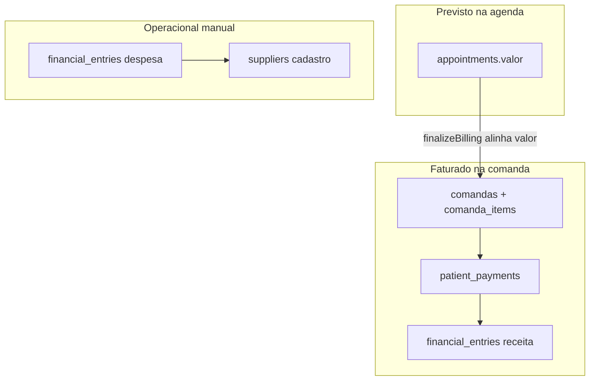
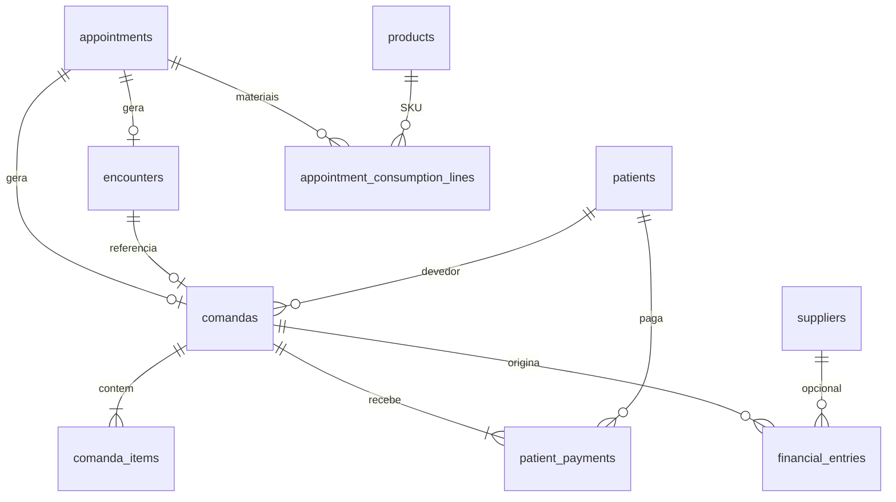
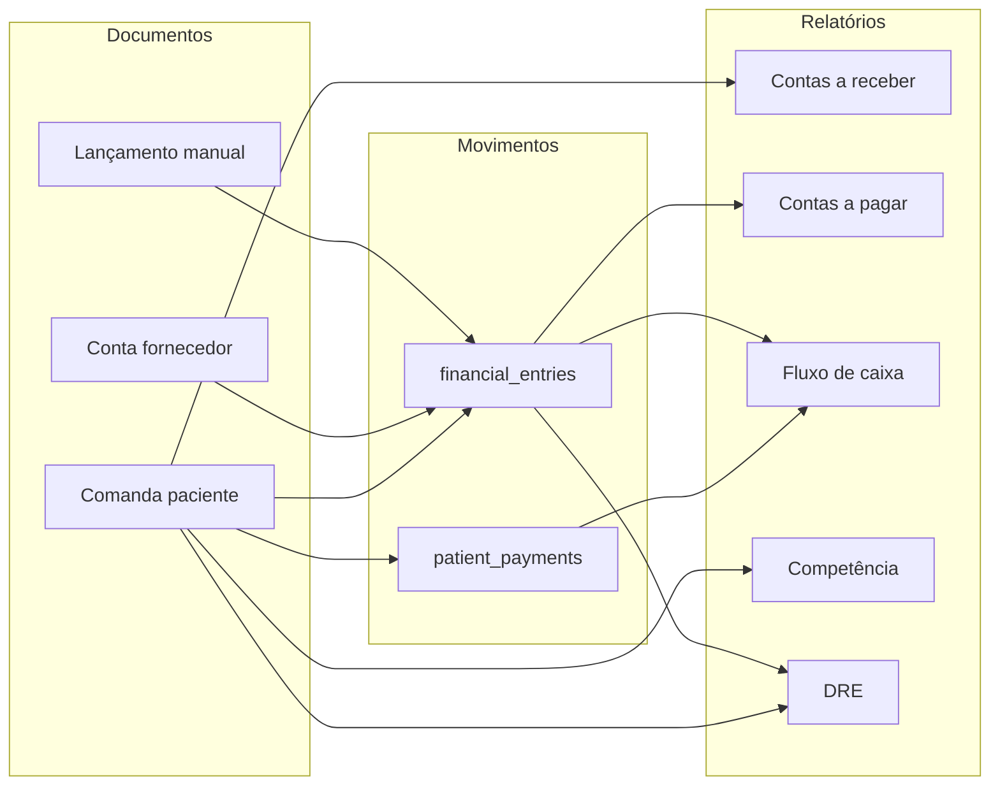

# Financeiro da clínica — mapa, lacunas e integração

Documento de referência para entender como o Flowmedi trata o **dinheiro da clínica** (pacientes, fornecedores, comandas, relatórios). Destina-se a admin/secretaria da clínica, produto e desenvolvimento.

> **Fluxo operacional (agenda → estoque → atendimento → cupom → caixa):** [`FLUXO-OPERACIONAL-COMPLETO.md`](FLUXO-OPERACIONAL-COMPLETO.md) · **Status v2:** [`FLUXO-OPERACIONAL-V2-STATUS.md`](FLUXO-OPERACIONAL-V2-STATUS.md)

> **Fora de escopo:** cobrança da assinatura Flowmedi (Stripe), faturamento Meta/WhatsApp e limites de plano SaaS. Isso é outro domínio (“clínica paga o Flowmedi”), não o financeiro operacional descrito aqui.

---

## Índice

1. [Resumo executivo](#1-resumo-executivo)
2. [Glossário](#2-glossário)
3. [Modelo de dados](#3-modelo-de-dados)
4. [Jornada do dinheiro](#4-jornada-do-dinheiro)
5. [Mapa de telas](#5-mapa-de-telas)
6. [Pergunta → onde olhar](#6-pergunta--onde-olhar)
7. [Lacunas](#7-lacunas)
8. [Modelo alvo (integração)](#8-modelo-alvo-integração)
9. [Roadmap por fases](#9-roadmap-por-fases)
10. [Permissões e papéis](#10-permissões-e-papéis)
11. [Checklist de implantação](#11-checklist-de-implantação)
12. [Apêndice — código](#12-apêndice--código)
13. [Decisões pendentes (validação)](#13-decisões-pendentes-validação)

---

## 1. Resumo executivo

### Para quem é

Administradores e secretarias da clínica que usam o Flowmedi para agendar, atender, cobrar pacientes e controlar despesas com fornecedores.

### O que o produto entrega hoje

| Capacidade | Situação |
|------------|----------|
| Precificar consultas na agenda (serviços + dimensões) | Ativo |
| Cobrar ao final do atendimento (comanda) | Ativo |
| Receber parcelas depois (comanda aberta/parcial) | Ativo |
| Contas a receber e a pagar | Ativo (com ressalvas) |
| Extrato de lançamentos | Ativo |
| Competência, fluxo de caixa, DRE simplificada | Ativo (lentes diferentes — ver abaixo) |
| Relatório de vendas por comanda | Ativo |
| Orçamentos, pacotes, NF do paciente | Stub (“em desenvolvimento”) |

### Por que parece desconexo

O sistema usa **três “lentes”** para falar de dinheiro, mas a interface nem sempre deixa isso explícito:

| Lente | O que mede | Fonte principal | Onde aparece |
|-------|------------|-----------------|--------------|
| **Previsto (agenda)** | Valor estimado da consulta | `appointments.valor` | Agenda, aba “Financeiro” do dashboard admin |
| **Faturado (competência)** | Valor cobrado ao paciente na comanda | `comandas.total_amount` | Vendas, Competência, DRE (receita bruta) |
| **Caixa** | Dinheiro que entrou ou saiu de fato | `patient_payments` + despesas pagas em `financial_entries` | Fluxo diário/mensal, parte do admin |

Quando alguém pergunta “qual foi a receita do mês?”, a resposta depende da tela — e os números **podem não bater**. Isso é comportamento atual da arquitetura, não um único bug.



### O que ainda não é

- ERP contábil completo (plano de contas, partidas dobradas)
- Nota fiscal do paciente (NFS-e/NF-e)
- Orçamentos comerciais e pacotes de sessões
- Conciliação bancária / PIX automático
- CMV (custo de material) automático na DRE
- Vínculo CRM → valor de negócio → comanda

---

## 2. Glossário

Termos usados daqui em diante no produto e neste documento.

| Termo | Definição | Exemplo na clínica |
|-------|-----------|-------------------|
| **Comanda** | Documento de cobrança do paciente ligado a uma consulta (`appointment`). Tem itens (serviço, materiais), total, valor pago e status. | Consulta de dermatologia R$ 350 + ácido R$ 80 → comanda R$ 430. |
| **Item da comanda** | Linha em `comanda_items`: serviço, procedimento, produto ou outro. | Linha “Peeling” (service), linha “Ácido 30%” (product). |
| **Pagamento do paciente** | Registro de entrada de caixa em `patient_payments`, sempre vinculado a uma comanda. | Paciente paga R$ 200 no PIX; saldo R$ 230 fica em aberto. |
| **Lançamento financeiro** | Linha em `financial_entries` (receita ou despesa). Pode ser gerada automaticamente na cobrança ou criada manualmente. | “Pagamento consulta” (receita, automática) ou “Aluguel março” (despesa, manual). |
| **Conta a receber (AR)** | O que a clínica ainda espera receber: saldo de comandas abertas/parciais + receitas manuais pendentes. | Comanda R$ 430 com R$ 200 pagos → AR R$ 230. |
| **Conta a pagar (AP)** | Despesas lançadas com status `pendente`. | Conta de laboratório com vencimento dia 15, ainda não paga. |
| **Competência** | Reconhecimento da receita pelo valor faturado na comanda, no período em que a comanda foi criada/fechada (não necessariamente quando o dinheiro entrou). | Comanda gerada em 03/06 → entra na competência de junho mesmo se o pagamento for em 10/06. |
| **Caixa / fluxo** | Movimentação real: pagamentos de pacientes (`paid_at`) e despesas marcadas como pagas (`paid_at` em `financial_entries`). | “Quanto entrou na conta este mês?” → fluxo mensal. |
| **DRE (versão atual)** | Demonstrativo simplificado: soma de `comandas.total_amount` no período − despesas pagas no período. Não inclui CMV automático nem impostos. | Último mês: receita bruta comandas − despesas operacionais pagas. |
| **Valor na agenda** | `appointments.valor` — estimativa ao agendar (regras de preço dimensional). Referência até existir comanda. | Agenda mostra R$ 300; na hora da cobrança materiais podem alterar o total. |
| **Atendimento / encounter** | Registro clínico da visita. Após cobrança, status passa a `cobrado`. | Médico finaliza ficha; secretaria finaliza comanda. |
| **Fornecedor** | Cadastro em `suppliers` para organizar quem a clínica paga. Hoje o lançamento de despesa ainda usa nome em texto livre na maioria dos fluxos. | “Lab XYZ” cadastrado em Contatos → Fornecedores. |

---

## 3. Modelo de dados

### Migrations e papel de cada uma

| Artefato | Arquivo | Papel |
|----------|---------|-------|
| Comandas, itens, pagamentos, lançamentos, encounters, estoque do hub | `supabase/migration-procedure-hub-operations.sql` | Núcleo do financeiro operacional da clínica |
| Fornecedores + `financial_entries.supplier_id` | `supabase/migration-suppliers.sql` | Cadastro master; FK existe, uso na UI ainda limitado |
| Serviços, dimensões, regras de preço | `supabase/migration-services-pricing-dimensions.sql` | Base de receita **prevista** na agenda |
| Modo de precificação (`centralizado` / `descentralizado`) | `supabase/migration-clinic-services-pricing-mode.sql` | Quem define preço na clínica |
| Consumo de estoque no encounter | `supabase/migration-encounter-stock-consumed.sql` | `encounters.stock_consumed_at` |

**Pré-requisito de ambiente:** se `migration-procedure-hub-operations.sql` não estiver aplicada, módulos Financeiro e Vendas falham em runtime.

### Diagrama simplificado (relações)



### Tabelas principais (uma frase cada)

| Tabela | Função |
|--------|--------|
| `appointments` | Consulta agendada; `valor` = preço previsto; `service_id` + dimensões |
| `encounters` | Atendimento clínico; `status` inclui `cobrado` após faturar |
| `appointment_consumption_lines` | Materiais consumidos no atendimento; travados após cobrança |
| `comandas` | Conta do paciente: `total_amount`, `paid_amount`, `status`, `closed_at` |
| `comanda_items` | Detalhamento: serviço, produto, etc. |
| `patient_payments` | Entrada de caixa do paciente |
| `financial_entries` | Livro auxiliar: receita/despesa, origem, status, vínculos |
| `suppliers` | Cadastro de fornecedores |
| `products` | Estoque: `cost`, `sale_price` (impactam itens da comanda) |
| `services` / `price_*` | Catálogo e precificação dimensional |

### Status importantes

**`comandas.status`**

| Valor | Significado |
|-------|-------------|
| `aberta` | Nada pago (ou total zero) |
| `parcial` | Pagamento menor que o total |
| `paga` | Quitada (`closed_at` preenchido quando paga na finalização) |
| `cancelada` | Excluída dos relatórios agregados |

**`financial_entries.status`**

| Valor | Significado |
|-------|-------------|
| `pendente` | AP ou receita manual ainda não recebida/paga |
| `pago` | Quitado (`paid_at` preenchido) |
| `cancelado` | Ignorado em totais |

**`financial_entries.origin`**

| Valor | Uso hoje |
|-------|----------|
| `patient` | Gerado ao receber pagamento de comanda |
| `supplier` | Despesa manual (fornecedor em texto) |
| `manual` | Receita/despesa lançada na mão |
| `stock` | Previsto no schema; **não gerado pelo código atual** |

**`encounters.status`**

| Status | Significado |
|--------|-------------|
| `em_andamento` | Atendimento clínico em curso |
| `finalizado_aguardando_cobranca` | Clínico encerrado (estoque consumido); comanda ainda não emitida ou não quitada |
| `cobrado` | Comanda quitada (`comandas.status = paga`) |

---

## 4. Jornada do dinheiro

Fluxo operacional que o time da clínica deve internalizar — da agenda ao relatório.

### Passo a passo

| # | Etapa | O que acontece | Onde no produto |
|---|--------|----------------|-----------------|
| 1 | **Agendar** | Serviço + dimensões → `resolveAppointmentPrice` grava `appointments.valor` | Agenda / modal de consulta |
| 2 | **Atender** | `startEncounter` cria `encounters`; consumo de materiais e fichas clínicas | Consulta, Atendimento clínico, Fila de atendimento |
| 3 | **Encerrar clínico** | `finishClinicalEncounter`: consome estoque, trava consumo, `encounters.status = finalizado_aguardando_cobranca`; **sem comanda** | Consulta / Atendimento — botão “Encerrar atendimento clínico” |
| 4 | **Prévia / emitir comanda** | `getBillingPreview` + `emitComanda`: subtotal, desconto, checkbox insumos; pagamento opcional; `issued_at` na emissão | Modal “Emitir comanda” |
| 5 | **Receber depois** | `registerComandaPayment` → `patient_payments` + `financial_entries`; ao quitar, encounter `cobrado` | Financeiro → Contas a receber |
| 6 | **Despesas** | `createFinancialEntry` (despesa) → AP; `markEntryPaid` quando paga | Financeiro → Contas a pagar |
| 7 | **Consultar** | Relatórios por lente (AR, AP, extrato, competência, fluxo, DRE) | `/dashboard/financeiro/*` |

### O que `finishClinicalEncounter` + `emitComanda` fazem

Referência: `app/dashboard/agenda/encounter-actions.ts`.

**Encerrar clínico (`finishClinicalEncounter`):**

1. Valida encounter `em_andamento`.
2. Consome estoque (`consumeStockForAppointment`) e trava linhas (`locked_at`).
3. Marca encounter `finalizado_aguardando_cobranca` + `completed_at`.
4. Marca consulta `realizada` e fichas `concluida`.
5. **Não** cria comanda nem movimenta caixa.

**Emitir comanda (`emitComanda`):**

1. Exige encounter `finalizado_aguardando_cobranca`; impede segunda comanda ativa.
2. Calcula subtotal (serviço ± insumos conforme checkbox), desconto e `total_amount`.
3. Insere `comandas` com `issued_at`, `subtotal_amount`, `discount_amount`, status `aberta`/`parcial`/`paga`.
4. Insere `comanda_items` (serviço; produtos só se `charge_materials_separately`).
5. Atualiza `appointments.valor` para o total faturado.
6. Pagamento opcional na emissão; encounter só vai a `cobrado` quando comanda quitada.

**Compatibilidade:** `finalizeBilling` chama os dois passos em sequência (fluxo legado “tudo de uma vez”).

### Competência de receita

Comandas entram na competência na **emissão** (`issued_at`), não no pagamento. Comandas `aberta` sem `issued_at` (legado) continuam usando `closed_at` ou exclusão conforme regras em `lib/financeiro/comanda-rules.ts`.

### CMV / insumos não faturados

Materiais consumidos no estoque mas **não** cobrados na comanda (checkbox desmarcado) entram como custo operacional via movimentação de estoque, não como linha de receita na comanda.

### Onde o usuário clica (cobrança)

| Contexto | Caminho | Quem costuma usar |
|----------|---------|-------------------|
| Consulta individual | `/dashboard/agenda/consulta/[id]` | Médico, secretaria |
| Atendimento clínico | `/dashboard/agenda/atendimento/[id]` | Médico |
| Fila de atendimento | `/dashboard/atendimento` | Secretaria (vê `comanda_status`) |
| Perfil do paciente | `/dashboard/pacientes/[id]` ou contatos | Secretaria (histórico) |
| Financeiro | `/dashboard/financeiro/receber` | Admin, secretaria (recebimentos tardios) |

### Precificação vs cobrança

- **Serviços e valores** (`/dashboard/servicos-valores`): define regras que alimentam a agenda — não movimenta caixa.
- **Produtos** (estoque): `sale_price` na comanda; `cost` usado se não houver preço de venda — custo **não** vira despesa automática hoje.

---

## 5. Mapa de telas

O menu separa **Vendas** e **Financeiro** (`lib/dashboard-nav-config.ts`). Mentalmente, ambos pertencem ao “financeiro da clínica”; a divisão histórica é: Vendas = visão comercial de comandas; Financeiro = AR/AP e relatórios contábeis simplificados.

### Hub recomendado (visão de produto, sem mudar rotas ainda)

| Área mental | Rotas atuais |
|-------------|--------------|
| Cobrar | Agenda, atendimento, fila |
| Receber / Pagar | `/dashboard/financeiro/receber`, `/dashboard/financeiro/pagar` |
| Relatórios | competência, fluxo, DRE, extrato |
| Comercial | `/dashboard/vendas/*` (parte stub) |

### Financeiro (`/dashboard/financeiro`)

Acesso: **admin** e **secretaria** (`layout.tsx` bloqueia **médico**).

| Rota | Título / função | Fonte de dados |
|------|-----------------|----------------|
| `/dashboard/financeiro` | Visão geral — cards recebido, a receber, pago, a pagar; comandas abertas; lançar despesa/receita manual | `getFinancialSummary`, `listOpenComandas`, `listFinancialEntries` |
| `.../receber` | Contas a receber — comandas em aberto + receitas manuais pendentes; registrar pagamento | Comandas + `financial_entries` (manual, pendente) |
| `.../pagar` | Contas a pagar — despesas pendentes; marcar como paga | `financial_entries` despesa `pendente` |
| `.../extrato` | Extrato — todos os lançamentos com filtros | `listFinancialEntries` |
| `.../competencia` | Receita por mês (comandas emitidas; mês = `issued_at` ou fallback `closed_at`/`created_at`) | `getCompetenceByMonth` |
| `.../fluxo-diario` | Entradas (`patient_payments`) vs saídas (despesas pagas) por dia | `getCashFlowDaily` |
| `.../fluxo-mensal` | Mesmo, agregado por mês | `getCashFlowMonthly` |
| `.../dre` | DRE simplificada — último mês: comandas − despesas pagas | `getSimpleDre` |

**Resumo financeiro (`getFinancialSummary`):**

- `recebido`: soma de `financial_entries` receita com status `pago` (inclui reflexos de pagamentos de comanda).
- `aReceber`: saldo de comandas `aberta`/`parcial` + receitas manuais pendentes.
- `pago` / `aPagar`: despesas pagas vs pendentes.

### Vendas (`/dashboard/vendas`)

Acesso: admin e secretaria.

| Rota | Status | Função |
|------|--------|--------|
| `/dashboard/vendas` | Ativo | Visão geral: total de vendas, ticket médio, top serviços (comandas recentes) |
| `.../relatorio` | Ativo | Lista de comandas (~90 dias) |
| `.../orcamentos` | **Stub** | Texto: cobrança hoje via comanda ao finalizar atendimento |
| `.../pacotes` | **Stub** | Pacotes comerciais não disponíveis |
| `.../notas-fiscais` | **Stub** | NF do paciente não ativa |

### Outros pontos do produto

| Local | Papel financeiro |
|-------|------------------|
| `/dashboard/servicos-valores` | Configura preços (agenda) |
| `/dashboard/contatos/fornecedores` | Cadastro; copy orienta usar nome ao lançar despesa |
| `/dashboard/pacientes/[id]` | Timeline: comandas, pagamentos, resumo |
| Dashboard admin → aba **Financeiro** | Métricas gerenciais: `appointments.valor` em consultas realizadas + caixa (`patient_payments`) + despesas — **pode divergir** das telas Financeiro |
| CRM / pipeline | Sem valor monetário ou vínculo com comanda |

### Terceira métrica: relatório admin

`getFinanceiroData` (`app/dashboard/reports/actions.ts`) calcula:

- **Receita total (competência gerencial):** soma de `appointments.valor` em consultas `realizada` no período — não exige comanda.
- **Receita caixa real:** soma de `patient_payments` no período.
- Despesas: `financial_entries` despesa criadas no período (pagas vs pendentes).

Isso é útil para gestão de agenda (faltas, ticket por profissional), mas **não substitui** comandas nem o extrato financeiro.

---

## 6. Pergunta → onde olhar

| Pergunta da clínica | Onde olhar | Lente |
|---------------------|------------|-------|
| Quanto este paciente ainda deve? | Comanda no atendimento / Financeiro → Receber / Perfil do paciente | AR |
| Quanto a clínica já recebeu (registrado no sistema)? | Visão geral → “Recebido” ou Extrato (receitas pagas) | Caixa / extrato |
| Quanto entrou no caixa neste mês? | Fluxo mensal | Caixa |
| Quanto faturamos (valor cobrado aos pacientes)? | Competência ou DRE → receita bruta | Competência |
| Quanto devemos a fornecedores? | Contas a pagar | AP |
| Qual o resultado simplificado do mês? | DRE | Misto (ver lacunas) |
| Quais serviços mais venderam? | Vendas → visão geral / relatório | Competência (comandas) |
| Qual era o preço previsto na agenda? | Consulta na agenda (`valor`) | Previsto |
| Histórico completo de lançamentos? | Extrato | Extrato |

---

## 7. Lacunas

Organizadas por severidade para priorização de produto e engenharia.

### Crítico — impacto na confiança nos números

| # | Lacuna | Efeito | Direção de solução |
|---|--------|--------|---------------------|
| C1 | Três definições de “receita” sem rótulo na UI | Usuário compara telas e acha que o sistema está errado | Rotular toda métrica: **Previsto** / **Faturado** / **Caixa**; tooltips e glossário in-app |
| C2 | DRE mistura lentes | Receita = comandas por `created_at`; despesas = pagas por `paid_at`; sem CMV | DRE em abas ou linhas separadas; opcional linha CMV quando `origin stock` existir |
| C3 | `supplier_id` não usado na UI | Cadastro de fornecedores desconectado do lançamento | Select de fornecedor em despesa; persistir FK |
| C4 | `origin = 'stock'` nunca populado | Custo de material consumido não aparece como despesa/CMV | Ao consumir estoque ou na comanda, gerar lançamento ou linha de custo na DRE |
| C5 | Relatório admin vs Financeiro | “Receita total” do admin ≠ receita de comandas | Documentar na UI; evoluir admin para preferir comandas quando existirem |

### Importante — produto incompleto ou frágil

| # | Lacuna | Efeito | Direção de solução |
|---|--------|--------|---------------------|
| I1 | Orçamentos, pacotes, NF paciente | Rotas existem mas não funcionam | Modelar `budgets`, pacotes, integração fiscal em fases posteriores |
| I2 | CRM sem valor | Pipeline não alimenta financeiro | Campo valor estimado + conversão em agendamento/comanda |
| I3 | Competência inclui comandas abertas | Receita reconhecida antes de fechar/pagar | Usar só comandas com `closed_at` ou status `paga`/`parcial` com regra clara |
| I4 | Duplicidade conceitual comanda + entry | Pagamento gera `patient_payments` e `financial_entries` | Manter entry como espelho do extrato; AR primário na comanda |
| I5 | `getFinancialSummary.recebido` só olha entries pagas | Pode confundir se entries manuais divergirem de pagamentos | Alinhar com soma de `patient_payments` ou documentar diferença |
| I6 | Cancelamento/estorno | Fluxo não documentado de ponta a ponta | Política: cancelar comanda, reverter pagamento, entries `cancelado` |

### Futuro — evolução desejável

| # | Lacuna |
|---|--------|
| F1 | Plano de contas e categorias de despesa/receita |
| F2 | Conciliação bancária / extrato OFX / PIX |
| F3 | Parcelamento estruturado e métodos de pagamento padronizados |
| F4 | Impostos e provisões na DRE |
| F5 | NFS-e/NF-e paciente e vínculo com comanda |
| F6 | Centro de custo por unidade/profissional |

---

## 8. Modelo alvo (integração)

Como o financeiro da clínica **deveria** se comportar quando integrado — norte para produto, sem implicar implementação imediata.

### Hierarquia

```
Evento de negócio (consulta, compra, despesa fixa, ajuste)
    → Documento (comanda, obrigação com fornecedor, lançamento manual)
        → Movimento de caixa (pagamento / recebimento)
            → Relatórios derivados (AR, AP, fluxo, competência, DRE)
```

### Regras de ouro

1. **Comanda = documento de receita do paciente.** Toda receita de atendimento converge na comanda; pagamentos são movimentos sobre ela.
2. **`financial_entries` = livro auxiliar unificado** para extrato, AP e receitas não-atendimento. Pagamentos de paciente devem ser **reflexo** de `patient_payments`, não uma segunda fonte de verdade para caixa.
3. **`appointments.valor` = estimativa** até existir comanda; relatórios gerenciais preferem comanda quando houver.
4. **Todo relatório declara a lente** (Caixa | Competência | Previsto) no título e no export.



### Contas a receber (alvo)

- **Primário:** saldo `total_amount - paid_amount` em comandas não quitadas.
- **Secundário:** receitas manuais (`origin manual`, `pendente`).
- **Não duplicar:** pagamentos já refletidos na comanda não devem inflar AR.

### Contas a pagar (alvo)

- Despesas `pendente` com `due_date`, vínculo `supplier_id`, categoria futura.
- Baixa via `markEntryPaid` → alimenta fluxo de caixa na data de pagamento.

### DRE (alvo)

| Linha | Fonte sugerida |
|-------|----------------|
| Receita bruta | Comandas no período (competência) |
| (-) CMV / materiais | Custo dos itens `product` ou `origin stock` |
| (=) Receita líquida operacional | Calculada |
| (-) Despesas operacionais | `financial_entries` despesa por competência ou caixa (escolha explícita) |
| (=) Resultado | Calculada |

### Integração com operação clínica

- Estoque consumido na cobrança já atualiza saldo; falta **espelhar custo** no financeiro.
- Procedimentos hub e fichas permanecem clínicos; financeiro só lê itens faturáveis.

---

## 9. Roadmap por fases

Roadmap **conceitual** — ordem sugerida de evolução.

### Fase 0 — Documentação e alinhamento (atual)

- Este documento como fonte única de verdade.
- Treinar admin/secretaria nas três lentes.
- Validar decisões da [seção 13](#13-decisões-pendentes-validação).

**Não fazer ainda:** refatorar menu, NF, banco.

### Fase 1 — Coerência de números

| Objetivo | Entregáveis de produto |
|----------|------------------------|
| Eliminar ambiguidade de “receita” | Rótulos em todas as telas; glossário linkado |
| Métrica oficial do dashboard admin | Decisão: comandas (faturado) ou caixa — aplicar uma regra |
| AR transparente | Card “A receber” explicando comandas + manual |
| Alinhar `recebido` | Definir se é entries, pagamentos ou ambos com reconciliação |

**Pré-requisito:** nenhum schema novo obrigatório.  
**Experiência da clínica:** confiança nos relatórios sem mudar fluxo de cobrança.

### Fase 2 — Operação básica completa

| Objetivo | Entregáveis |
|----------|-------------|
| Fornecedores integrados | Despesa com `supplier_id` |
| CMV / estoque no financeiro | Lançamentos `origin stock` ou linha na DRE |
| Cancelamento/estorno | Fluxo documentado e botões claros |
| Competência | Regra única para comandas abertas |

**Experiência:** despesa e custo de material visíveis no resultado.

### Fase 3 — Vendas antes do atendimento

| Objetivo | Entregáveis |
|----------|-------------|
| Orçamentos | Proposta → aceite → agendamento/comanda |
| Pacotes | Saldo de sessões descontado por atendimento |
| Vendas unificadas | Hub comercial ligado a comandas |

**Experiência:** vender antes da consulta sem planilha paralela.

### Fase 4 — Fiscal e bancário

| Objetivo | Entregáveis |
|----------|-------------|
| NFS-e paciente | Emissão ligada à comanda |
| Conciliação | Import ou integração bancária |

**Pré-requisito:** Fases 1–2 estáveis.  
**Não antecipar:** NF sem comanda e extrato confiáveis.

---

## 10. Permissões e papéis

| Papel | Financeiro (`/dashboard/financeiro`) | Cobrança no atendimento | Vendas | Relatório admin “Financeiro” |
|-------|--------------------------------------|-------------------------|--------|------------------------------|
| **admin** | Acesso total | Sim | Sim | Sim, se plano tiver `reports_managerial_enabled` |
| **secretaria** | Acesso total | Sim | Sim | Depende do dashboard (geralmente admin) |
| **medico** | **Bloqueado** no layout | Sim (`finalizeBilling` na consulta/atendimento) | Bloqueado | Não |

**Implicação operacional:** o médico pode registrar cobrança na ponta; conferência, recebimentos tardios e despesas ficam com secretaria/admin. Definir processo interno da clínica (quem fecha comanda, quem confere caixa).

**Gate de plano:** `reports_managerial_enabled` restringe a aba Financeiro no dashboard admin (`lib/plan-gates.ts`), **não** o módulo `/dashboard/financeiro`.

---

## 11. Checklist de implantação

Por clínica nova ou ao revisar por que os números “não fecham”:

- [ ] Migrations aplicadas no Supabase:
  - [ ] `migration-procedure-hub-operations.sql`
  - [ ] `migration-suppliers.sql`
  - [ ] `migration-services-pricing-dimensions.sql`
  - [ ] `migration-clinic-services-pricing-mode.sql` (se usar serviços)
- [ ] Serviços e dimensões de preço configurados em **Serviços e valores**
- [ ] Produtos com `sale_price` (venda) e `cost` (fallback) no estoque
- [ ] Fornecedores cadastrados em **Contatos → Fornecedores** (enquanto UI usa nome livre, usar nome consistente)
- [ ] Equipe treinada:
  - [ ] Diferença entre valor na agenda e total da comanda
  - [ ] “Finalizar comanda” no atendimento vs lançamento manual no Financeiro
  - [ ] Onde registrar pagamento posterior (Contas a receber)
  - [ ] Onde lançar e baixar despesas (Contas a pagar)
- [ ] Processo definido: médico cobra ou só secretaria?
- [ ] Expectativa alinhada: DRE atual é simplificada, não substitui contador

---

## 12. Apêndice — código

Referência rápida para desenvolvimento (sem duplicar código aqui).

| Área | Caminho |
|------|---------|
| UI Financeiro | `app/dashboard/financeiro/` |
| Actions AR/AP/extrato | `app/dashboard/financeiro/actions.ts` |
| Carga de páginas | `app/dashboard/financeiro/load-financeiro-data.ts` |
| Relatórios competência/fluxo/DRE | `lib/financial-reports.ts` |
| Relatórios vendas | `lib/vendas-reports.ts` |
| Cobrança e comandas | `app/dashboard/agenda/encounter-actions.ts` |
| Prévia e estoque na cobrança | `lib/clinic-operations.ts` |
| Preço na agenda | `app/dashboard/agenda/actions.ts` (`resolveAppointmentPrice`) |
| Relatório admin financeiro | `app/dashboard/reports/actions.ts` (`getFinanceiroData`) |
| Menu | `lib/dashboard-nav-config.ts` |
| Fornecedores | `app/dashboard/contatos/fornecedores/` |
| Migrations | `supabase/migration-procedure-hub-operations.sql`, `migration-suppliers.sql`, `migration-services-pricing-dimensions.sql` |

---

## 13. Decisões pendentes (validação)

Itens para alinhar com o negócio antes da **Fase 1** de implementação. Marque a opção preferida da clínica / produto.

### 13.1 Métrica oficial no dashboard admin

Quando a aba “Financeiro” do admin mostrar “receita do período”, qual deve ser a fonte primária?

| Opção | Prós | Contras |
|-------|------|---------|
| **A — Comandas (faturado)** | Alinha com Vendas e DRE | Ignora consultas realizadas sem comanda |
| **B — Caixa (`patient_payments`)** | Reflete dinheiro entrado | Ignora vendas a prazo / comanda aberta |
| **C — Duas métricas sempre visíveis** | Mais claro | Ocupa mais espaço na UI |

**Recomendação do documento:** opção **C** a curto prazo; a longo prazo, comanda como “faturado” e pagamentos como “caixa”.

### 13.2 Rótulos padrão na interface

| Termo atual (implícito) | Rótulo sugerido |
|-------------------------|-----------------|
| Receita / total vendas | **Receita faturada (comandas)** |
| Recebido / entradas | **Entradas no caixa** |
| Valor na agenda | **Valor previsto na agenda** |
| DRE receita bruta | **Receita faturada no período** |

### 13.3 Quem pode finalizar comanda

| Opção | Descrição |
|-------|-----------|
| Manter | Médico e secretaria na consulta; secretaria no Financeiro para recebimentos |
| Restringir | Só secretaria/admin finaliza; médico só pré-visualiza |

### 13.4 Competência: comandas abertas

| Opção | Regra |
|-------|-------|
| **A** | Competência só com `closed_at` preenchido ou status `paga` |
| **B** | Manter `created_at` (atual) mas exibir aviso na tela |
| **C** | Duas séries: “faturado emitido” vs “faturado quitado” |

---

## Histórico do documento

| Data | Alteração |
|------|-----------|
| 2026-06-04 | Versão inicial — mapa, lacunas e roadmap conceitual |

---

*Dúvidas ou priorização da Fase 1: atualizar a seção 13 e registrar decisões nesta tabela ou em issue de produto.*
