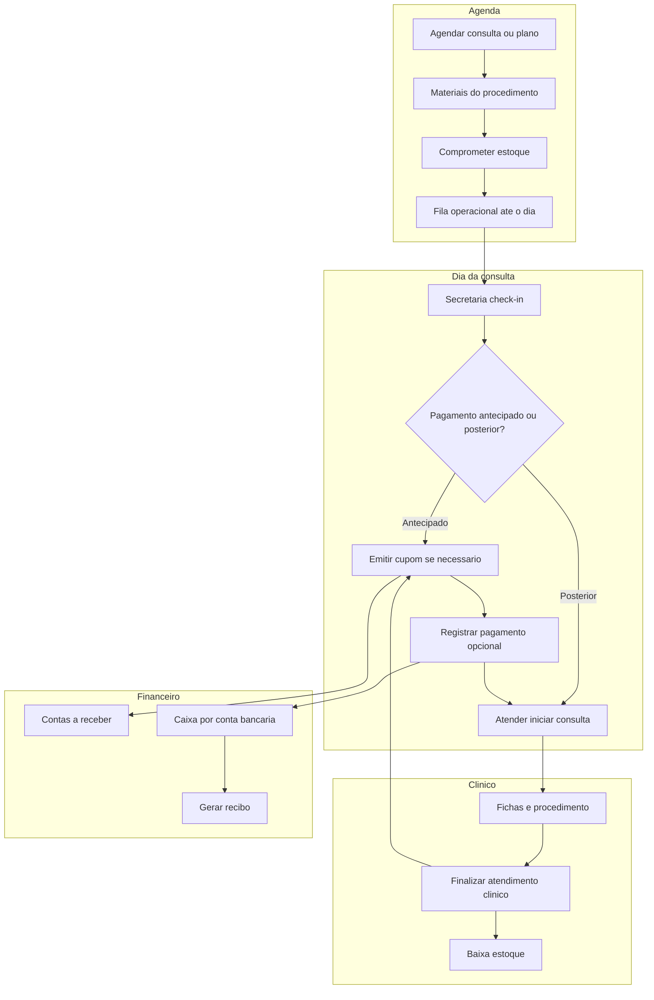

# Fluxo operacional e financeiro completo

Documento de referência para **agenda → estoque → atendimento → cupom → caixa → recibo**, incluindo tratamentos multi-sessão, contas bancárias e evolução de estoque (lotes/validade).

Complementa [`FINANCEIRO-MAPA-E-LACUNAS.md`](FINANCEIRO-MAPA-E-LACUNAS.md) (lentes Previsto / Faturado / Caixa) com a **jornada operacional** ponta a ponta.

**Status v2.0:** [`FLUXO-OPERACIONAL-V2-STATUS.md`](FLUXO-OPERACIONAL-V2-STATUS.md) — lacunas fechadas, decisões D1–D8 e pendências N-01+.

> **Fora de escopo:** assinatura Flowmedi (Stripe), NFS-e/NF-e fiscal completa, conciliação bancária automática (OFX/PIX webhook).

---

## Índice

1. [Resumo executivo](#1-resumo-executivo)
2. [Glossário operacional](#2-glossário-operacional)
3. [Decisões de produto](#3-decisões-de-produto)
4. [Fluxo alvo (diagrama)](#4-fluxo-alvo-diagrama)
5. [Passo a passo operacional](#5-passo-a-passo-operacional)
6. [Eventos contábeis simplificados](#6-eventos-contábeis-simplificados)
7. [Cenários de pagamento](#7-cenários-de-pagamento)
8. [UI por papel e rotas](#8-ui-por-papel-e-rotas)
9. [Estado atual vs alvo](#9-estado-atual-vs-alvo)
10. [Lacunas numeradas](#10-lacunas-numeradas)
11. [Modelo de dados (extensões)](#11-modelo-de-dados-extensões)
12. [Roadmap por fases](#12-roadmap-por-fases)
13. [Decisões pendentes (validação com a clínica)](#13-decisões-pendentes-validação-com-a-clínica)
14. [Apêndice — código](#14-apêndice--código)

---

## 1. Resumo executivo

### Narrativa desejada

1. **Agendar** → sistema lê materiais do procedimento → **compromete estoque** → consulta entra na **fila operacional** até o dia.
2. **No dia** → secretaria faz **check-in** e define **pagamento antecipado ou posterior**.
3. **Atender** → consulta iniciada (encounter + timer) → médico na aba **Clínico** preenche fichas.
4. **Finalizar atendimento clínico** → **baixa estoque** (consumo), trava materiais.
5. **Emitir cupom** (comanda no banco) → entra em **contas a receber** se não pago.
6. **Receber pagamento** → movimento de **caixa** na **conta bancária** escolhida → gera **recibo** para o paciente.
7. Tratamentos com **várias sessões** usam **plano de tratamento** (pacote) + consultas filhas na agenda.

### Três documentos (decisão de produto)

| Documento | Tabela / artefato | Quando | Função |
|-----------|-------------------|--------|--------|
| **Plano de tratamento** | `treatment_plans` | Venda do pacote (N sessões) | Âncora financeira: valor total, parcelas, sessões restantes |
| **Cupom** | `comandas` (UI: “Cupom”) | Agenda, check-in ou pós-clínico | Obrigação de receita da sessão; AR |
| **Recibo** | `receipts` + PDF | Após `patient_payments` | Comprovante ao paciente; não altera AR |

---

## 2. Glossário operacional

| Termo | Significado |
|-------|-------------|
| **Comprometido** | Reserva de estoque ao agendar (`quantity_committed`). |
| **Consumido** | Baixa definitiva ao **finalizar atendimento clínico**. |
| **Check-in** | Secretaria confirma presença e política de pagamento no dia. |
| **Atender** | Inicia consulta (`started_at` + `encounter em_andamento`). |
| **Cupom** | Nome de UI para `comandas` emitidas (`issued_at`). |
| **Recibo** | Comprovante pós-pagamento; vínculo com `patient_payments`. |
| **Plano de tratamento** | Pacote multi-sessão com saldo financeiro e de sessões. |
| **Política de pagamento** | `antecipado` \| `no_dia` \| `pos_atendimento` (campo em `appointments`). |

---

## 3. Decisões de produto

### 3.1 Documentos

- Manter **`comandas`** no banco; renomear na UI para **Cupom**.
- **Recibo** só após movimento de caixa (não substituir cupom).
- **Plano de tratamento** para multi-sessão; cada consulta pode referenciar o plano.

### 3.2 Multi-sessão (híbrido)

| Camada | Responsabilidade |
|--------|------------------|
| Plano | Valor total, parcelas, sessões totais/restantes |
| Agenda | Consultas filhas (`treatment_plan_id`, `session_number`) |
| Sessão | Comprometer → consumir → cupom ou “já pago no plano” |

### 3.3 Competência (default implementado)

- Receita faturada na **emissão do cupom** (`issued_at`) — ver [`lib/financeiro/comanda-rules.ts`](../lib/financeiro/comanda-rules.ts).
- Caixa na data de **`patient_payments.paid_at`**.
- CMV automático: **futuro** (Fase 5).

---

## 4. Fluxo alvo (diagrama)

---

## 5. Passo a passo operacional

| # | Etapa | Ação / server action | Efeito |
|---|--------|----------------------|--------|
| 1 | Agendar | `createAppointment` + `commitStockForAppointment` | `appointments.valor` previsto; estoque comprometido |
| 2 | Fila | Lista em `/dashboard/atendimento` | Badge operacional |
| 3 | Check-in | `setAppointmentPaymentPolicy` | Grava política de pagamento |
| 4 | Atender | `beginAppointmentCare` | `started_at` + `encounter em_andamento` + fichas |
| 5 | Clínico | Fichas em `/dashboard/agenda/atendimento/[id]` | Registro clínico |
| 6 | Encerrar clínico | `finishClinicalEncounter` | Consumo estoque; `finalizado_aguardando_cobranca` |
| 7 | Emitir cupom | `emitComanda` | `issued_at`; AR se não pago |
| 8 | Receber | `registerComandaPayment` | Caixa; encounter `cobrado` se quitado |
| 9 | Recibo | `generateReceiptForPayment` | PDF / número sequencial |

---

## 6. Eventos contábeis simplificados

| Evento | Estoque | Competência (receita) | Caixa | Obrigação |
|--------|---------|----------------------|-------|-----------|
| Agendar + comprometer | committed ↑ | — | — | — |
| Emitir cupom | — | `total_amount` em `issued_at` | — | AR |
| Receber pagamento | — | — | entrada (líquido após taxa cartão) | AR ↓ |
| Finalizar clínico | consumed | — | — | entrega insumos (operacional) |
| Insumos não faturados no cupom | consumed | só serviço na receita | — | CMV futuro via estoque |

---

## 7. Cenários de pagamento

| Cenário | Cupom | Caixa | AR | Observação |
|---------|-------|-------|-----|------------|
| 100% na agenda | No agendamento | Imediato | 0 após pagar | Política `antecipado` |
| Sinal + saldo | Total na emissão | Parcial + resto no dia | Saldo | Vários `patient_payments` |
| Paga no dia antes do médico | Check-in | Antes de atender | 0 se quitar | Recepção operacional |
| Paga depois | Após clínico | Financeiro | Total até receber | `pos_atendimento` |
| Pacote 10 sessões à vista | No plano | Uma vez | 0 no plano | `treatment_plans` |
| Pacote parcelado cartão | No plano | N parcelas + taxa MDR | — | `payment_fee_rules` |
| Sessão do pacote já paga | Opcional / zerada | — | — | Rateio no plano |
| Materiais inclusos no serviço | Só linha serviço | — | — | `charge_materials_separately = false` |
| Cancelamento / falta | Cancelar cupom | Estorno manual | Liberar comprometido | `releaseStockForAppointment` |

---

## 8. UI por papel e rotas

### Rotas principais

| Rota | Papel | Conteúdo |
|------|-------|----------|
| `/dashboard/atendimento` | Secretaria | Fila operacional |
| `/dashboard/agenda/consulta/[id]?tab=operacional` | Secretaria, admin, médico | Check-in + **Operacional** (`AtendimentoClient` full) |
| `/dashboard/agenda/atendimento/[id]` | Médico | Fichas + **Finalizar atendimento clínico** |
| `/dashboard/financeiro/receber` | Admin, secretaria | AR + recebimentos + recibo |
| `/dashboard/configuracoes/contas-bancarias` | Admin | Contas e taxas cartão |

### Navegação Recepção | Clínico

Componente: [`components/appointment-encounter-nav.tsx`](../components/appointment-encounter-nav.tsx)

- **Recepção** → operacional, check-in, cupom, caixa.
- **Clínico** → fichas; encerrar clínico no rodapé (médico).

### Status na fila

| Badge | Condição |
|-------|----------|
| Aguardando check-in | Sem política de pagamento (opcional) |
| Aguardando médico | Atendimento não iniciado |
| Em atendimento | `em_andamento` |
| Aguardando cupom | Clínico encerrado, sem cupom |
| Cupom aberto | Comanda aberta/parcial |
| Quitado | Comanda paga / encounter cobrado |

---

## 9. Estado atual vs alvo

| Capacidade | Hoje | Alvo |
|------------|------|------|
| Comprometer no agendamento | Sim | Mantido |
| Consumir no encerrar clínico | Sim | Mantido |
| Cupom com desconto / insumos | Sim | UI “Cupom” |
| UI operacional na recepção | Parcial / Fase 0 | Tab Operacional |
| Unificar Atender | Dois fluxos separados | `beginAppointmentCare` |
| Check-in pagamento | Não | Fase 1 |
| Contas bancárias | Não | Fase 2 |
| Taxa cartão | Não | Fase 2 |
| Recibo PDF | Não | Fase 2 |
| Plano multi-sessão | Não | Fase 3 |
| Lotes / validade | Flag `expiry_tracked` only | Fase 4 |

---

## 10. Lacunas numeradas

| ID | Lacuna | Direção |
|----|--------|---------|
| L-UI | Operacional na recepção | **Fechado** — tab Operacional + fila |
| L-START | Dois inícios de atendimento | **Fechado** — `beginAppointmentCare` |
| L-PAY | Política antecipado/posterior | **Fechado** — check-in + gate `emitComanda` |
| L-PLAN | Plano multi-sessão | **Parcial** — rateio OK; recorrência N-01 |
| L-BANK | Conta bancária | **Fechado** |
| L-CARD | MDR + despesa D4 | **Fechado** |
| L-LOT | FEFO lotes | **Fechado** |
| L-DOC | Labels Cupom/Recibo | **Fechado** |
| L-CMV | CMV na DRE | **Pendente** Fase 5 |

---

## 11. Modelo de dados (extensões)

Migration: [`migration-operational-flow-extensions.sql`](../supabase/migration-operational-flow-extensions.sql) + [`migration-operational-flow-v2-gaps.sql`](../supabase/migration-operational-flow-v2-gaps.sql)

| Entidade | Campos principais | Fase |
|----------|-------------------|------|
| `appointments` | `payment_policy`, `treatment_plan_id`, `session_number` | 1 / 3 |
| `bank_accounts` | clinic_id, name, bank, agency, account, active | 2 |
| `payment_fee_rules` | method, card_brand, installments, fee_percent | 2 |
| `patient_payments` | bank_account_id, gross_amount, fee_amount, net_amount, installments, card_brand | 2 |
| `receipts` | payment_id, receipt_number, issued_at | 2 |
| `treatment_plans` | patient_id, total_amount, sessions_total, sessions_used, payment_policy, status | 3 |
| `product_field_definitions` | clinic_id, slug, label, field_type | 4 |
| `product_field_values` | product_id, field_id, value | 4 |
| `stock_lots` | product_id, lot_code, expiry_date, quantity_on_hand | 4 |

---

## 12. Roadmap por fases

| Fase | Escopo | Status |
|------|--------|--------|
| **0–4** | UI, check-in, caixa, planos, lotes | Ver [`FLUXO-OPERACIONAL-V2-STATUS.md`](FLUXO-OPERACIONAL-V2-STATUS.md) |
| **5** | CMV automático, passivo formal na DRE | Pendente |

---

## 13. Decisões de produto (v2.0)

Decisões **fechadas** — ver matriz D1–D8 em [`FLUXO-OPERACIONAL-V2-STATUS.md`](FLUXO-OPERACIONAL-V2-STATUS.md).

Pendências evolutivas (N-01 a N-08 no status doc): recorrência de agenda, uso de créditos no pagamento, PDF recibo no Storage, CMV/DRE, fiscal.

---

## 14. Apêndice — código

| Área | Arquivo |
|------|---------|
| Operacional / cupom | `app/dashboard/agenda/encounter-actions.ts` |
| UI operacional | `app/dashboard/agenda/consulta/[id]/atendimento-client.tsx` |
| Check-in | `app/dashboard/agenda/consulta/[id]/check-in-payment-policy.tsx` |
| Iniciar atendimento unificado | `beginAppointmentCare` em `encounter-actions.ts` |
| Estoque | `lib/clinic-operations.ts` |
| Financeiro / caixa | `app/dashboard/financeiro/actions.ts` |
| Contas bancárias | `app/dashboard/configuracoes/contas-bancarias/` |
| Planos | `app/dashboard/planos-tratamento/` |
| Regras competência | `lib/financeiro/comanda-rules.ts` |
| Mapa financeiro | `docs/FINANCEIRO-MAPA-E-LACUNAS.md` |
