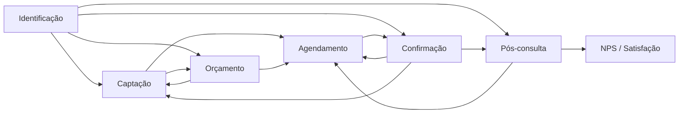
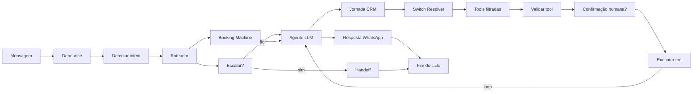
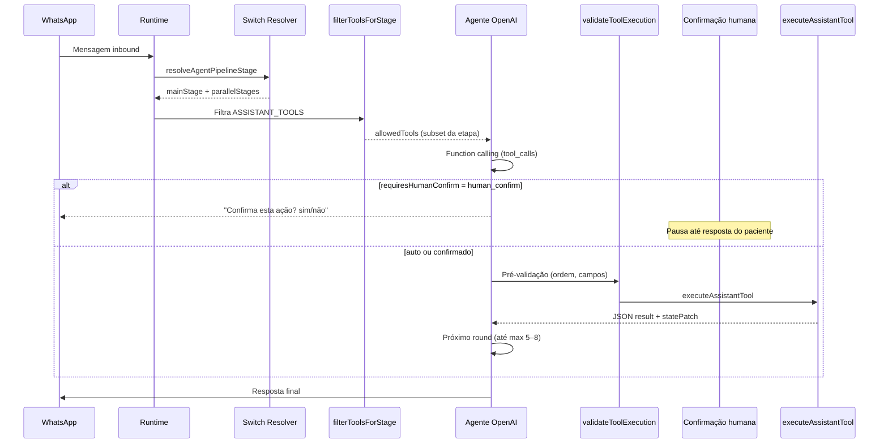

# Pipeline do Agente Virtual — Fluxo Completo

Documento de referência do estado **atual** do pipeline de IA (WhatsApp), incluindo jornada CRM, execução por mensagem, etapas paralelas, saídas e visualização em **Configurações → Assistente Virtual → Pipeline**.

> **Fonte de verdade no código:** `lib/virtual-assistant/agent-pipeline/`

---

## Visão geral

O pipeline tem **duas camadas** que se complementam:

| Camada | O que representa | Onde ver no UI |
|--------|------------------|----------------|
| **Execução (runtime)** | O que acontece a cada mensagem WhatsApp (debounce → intent → agente → tools → resposta) | Aba **Execução** / **Passo a passo** |
| **Jornada CRM** | Em qual etapa comercial/clínica o contato está e para onde pode ir | Aba **Jornada CRM** |

A etapa ativa em runtime é decidida pelo **Switch Resolver** (`resolveAgentPipelineStage`), que consulta `ai_state`, journey step e intent detectado. A etapa escolhida **filtra quais tools** o LLM pode chamar (`filterToolsForStage`).

---

## Diagrama — Jornada CRM (linha principal)



### Etapas globais (paralelas / transversais)

Ficam **abaixo** da linha principal no canvas. **Não têm linhas cruzando** o fluxo main — aparecem como cards com badge **global**:

| Etapa | Tipo | Função |
|-------|------|--------|
| **Financeiro** | Paralela | Consultar status de pagamento (somente leitura) |
| **Formulários** | Paralela | Status e reenvio de formulários pendentes |
| **Escalonamento** | Transversal | Transferir conversa para humano (`transfer_to_human`) |

---

## As 10 etapas do canvas

| # | Código | Label | Tipo | Fase CRM |
|---|--------|-------|------|----------|
| 1 | `identificacao` | Identificação do contato | main | Captação |
| 2 | `captacao` | Captação / Descoberta | main | Captação |
| 3 | `orcamento` | Orçamento / Negociação | main | Comercial |
| 4 | `agendamento` | Agendamento | main | Pré-consulta |
| 5 | `confirmacao_pre_consulta` | Confirmação pré-consulta | main | Pré-consulta |
| 6 | `pos_consulta` | Pós-consulta / Retorno | main | Pós-consulta |
| 7 | `satisfacao` | Satisfação (NPS) | main | Pós-atendimento |
| 8 | `financeiro` | Financeiro (somente leitura) | parallel | Financeiro |
| 9 | `formularios` | Formulários | parallel | Pré-consulta |
| 10 | `escalonamento` | Transferir para humano | transversal | Transversal |

---

## Transições CRM (17 arestas main + parallel)

### Linha principal (`kind: main`)

| De | Para | Label / gatilho |
|----|------|-----------------|
| Identificação | Captação | Paciente não encontrado |
| Identificação | Confirmação | Consulta futura |
| Identificação | Orçamento | Orçamento pendente |
| Identificação | Pós-consulta | Consulta realizada |
| Captação | Orçamento | Interesse em preço formal (`pricing` / `quote`) |
| Captação | Agendamento | Quer agendar (`booking`) |
| Orçamento | Agendamento | Orçamento aceito (ação humana) |
| Orçamento | Captação | Sem resposta (timeout) |
| Agendamento | Confirmação | Agendamento criado (`create_appointment`) |
| Confirmação | Pós-consulta | Consulta realizada |
| Confirmação | Agendamento | Remarcar (`reschedule` / `cancellation_reason=reschedule`) |
| Confirmação | Captação | Desistiu (`cancel_appointment` com `dropped` ou `other`) |
| Pós-consulta | Agendamento | Retorno necessário |
| Pós-consulta | NPS | Pesquisa NPS enviada |

### Paralelas (`kind: parallel` — overlay, sem linha no canvas da Jornada)

| De | Para | Quando ativa |
|----|------|--------------|
| Identificação | Financeiro | Intent `payment` ou journey `pagamento_*` |
| Agendamento | Formulários | Journey `formulario_pendente` |
| Confirmação | Formulários | Intent `form` |

### Transversal (modelo — não desenhada na aba Jornada)

Todas as etapas **main** podem escalar para **Escalonamento** (`transfer_to_human`). No canvas atual, o fan-out vermelho foi removido; escalonamento aparece como nó global e na aba **Saídas**.

---

## Detalhe por etapa — tools e condições

### 1. Identificação
- **Objetivo:** reconhecer quem está falando e posicionar na jornada.
- **Pré-condição:** telefone da conversa disponível.
- **Tools leitura:** `lookup_patient_by_phone`, `get_contact_journey`
- **Tools mutáveis:** nenhuma
- **Saídas:** Captação, Confirmação, Orçamento, Pós-consulta

### 2. Captação
- **Objetivo:** descobrir interesse, serviços e preços informativos.
- **Tools leitura:** `list_services`, `list_procedures`, `get_procedure_info`, `get_service_price`, `list_price_options`, `get_contact_journey`, `lookup_patient_by_phone`
- **Saídas:** Orçamento, Agendamento

### 3. Orçamento
- **Objetivo:** resolver oferta, enviar orçamento, consultar status.
- **Tools leitura:** `resolve_quote_offer`, `get_quote_status`, `get_contact_journey`, `get_service_price`, `list_price_options`
- **Tools mutáveis:** `create_and_send_quote`
- **Ordem obrigatória:** `resolve_quote_offer` → `create_and_send_quote`
- **Saídas:** Agendamento (aceito), Captação (sem resposta)

### 4. Agendamento
- **Objetivo:** procedimento, médico, horário, criar consulta.
- **Tools leitura:** `list_procedures`, `list_doctors`, `find_available_slots`, `get_contact_journey`, `lookup_patient_by_phone`
- **Tools mutáveis:** `register_patient`, `create_appointment`
- **Ordem obrigatória:** `list_procedures` → `list_doctors` → `find_available_slots` → `register_patient` → `create_appointment`
- **Saída:** Confirmação (consulta criada)

### 5. Confirmação pré-consulta
- **Objetivo:** confirmar, remarcar ou cancelar consultas futuras.
- **Tools leitura:** `list_patient_appointments`
- **Tools mutáveis:** `confirm_appointment`, `reschedule_appointment`, `cancel_appointment`
- **Saídas:** Pós-consulta, Agendamento, Captação

### 6. Pós-consulta
- **Objetivo:** retorno, histórico, novo ciclo.
- **Tools leitura:** `list_patient_appointments`, `get_contact_journey`
- **Tools mutáveis:** `create_appointment` (retorno)
- **Saídas:** Agendamento, NPS

### 7. NPS / Satisfação
- **Objetivo:** coletar feedback pós-atendimento (Net Promoter Score).
- **Tools leitura:** `get_contact_journey`
- **Tools mutáveis:** `collect_nps_feedback`
- **Pré-condições:** consulta realizada, pesquisa ativa
- **Saídas:** encerra ciclo ou reabre agendamento

### 8. Financeiro (paralela)
- **Objetivo:** informar status de pagamento — **nunca registra pagamento**.
- **Tools:** `get_payment_status` (somente leitura)
- **Ativa quando:** intent `payment` ou journey em `pagamento_pendente`, `pagamento_parcial`, `pago`

### 9. Formulários (paralela)
- **Objetivo:** status e reenvio de formulários pendentes.
- **Tools leitura:** `get_form_status`
- **Tools mutáveis:** `resend_form_link`
- **Ativa quando:** intent `form` ou journey `formulario_pendente`

### 10. Escalonamento (transversal)
- **Objetivo:** transferir para atendente humano.
- **Tools mutáveis:** `transfer_to_human`
- **Gatilhos:** pedido explícito, reclamação, falhas repetidas de tool, gate `shouldEscalateToHuman`

---

## Switch Resolver — prioridade 1→9

A cada mensagem, após carregar a jornada, o resolver escolhe **uma** etapa principal:

| Prioridade | Regra | Etapa resultante |
|------------|-------|------------------|
| 1 | `pipeline_stage` persistido no `ai_state` | Etapa persistida (com override: booking done → Confirmação) |
| 2 | `pending_confirmation_appointment_id` existe | Confirmação |
| 3 | `booking_step` ≠ done | Agendamento |
| 4 | `last_created_appointment_id` existe | Confirmação |
| 5 | Journey step em conjuntos fixos (consulta agendada, orçamento enviado, etc.) | Etapa do conjunto |
| 6 | `JOURNEY_STEP_TO_PIPELINE_STAGE[journeyStep]` | Etapa mapeada |
| 7 | Intent: payment, form, booking, reschedule, pricing, quote, my_appointments, cancel | Agendamento / Orçamento / etc. |
| 8 | Paciente não encontrado | Identificação |
| 9 | Default (paciente existe) | Captação |

**Etapas paralelas adicionais** (`resolveParallelStages`): Financeiro e/ou Formulários podem ser ativadas **junto** com a etapa main, liberando tools extras no overlay.

---

## Mapeamento Journey Step → Etapa Pipeline

Trecho dos steps CRM mais usados (`JOURNEY_STEP_TO_PIPELINE_STAGE`):

| Journey step | Etapa pipeline |
|--------------|----------------|
| `origem_identificada` | Identificação |
| `primeiro_contato`, `qualificacao`, `informacoes_enviadas` | Captação |
| `negociacao`, `orcamento_*` | Orçamento |
| `fechamento_agendamento`, `cadastro_pendente` | Agendamento |
| `consulta_agendada`, `consulta_confirmada`, `lembrete_*` | Confirmação |
| `consulta_realizada`, `retorno_*`, `consulta_falta` | Pós-consulta |
| `pagamento_*` | Financeiro |
| `formulario_pendente` | Formulários |
| `formulario_ok` | Confirmação |
| `pesquisa_nps_enviada`, `feedback_recebido` | NPS |
| `consulta_cancelada` | Captação |

Lista completa: `lib/virtual-assistant/agent-pipeline/stages.ts` → `JOURNEY_STEP_TO_PIPELINE_STAGE`.

---

## Execução por mensagem (runtime)

Fluxo técnico a cada inbound WhatsApp:



### Nós runtime (16)

`runtime_msg` → `runtime_debounce` → `runtime_detect_intent` → `runtime_router` → (`runtime_booking` | `runtime_escalate_gate`) → `runtime_agent` → `runtime_journey` → `runtime_resolver_switch` → `runtime_tools_hub` → `runtime_validate_tool` → `runtime_confirm_gate` → `runtime_execute_tool` → (loop) → `runtime_response` → `runtime_end`

Saídas: `runtime_handoff`, `runtime_end`

### Regras de saída (`EXIT_FLOW_RULES`)

| Saída | Gatilho | Efeito |
|-------|---------|--------|
| Handoff imediato | `shouldEscalateToHuman` antes do agente | `transfer_to_human`, fim IA |
| Escalonamento por etapa | Escalar de qualquer etapa main | Tool `transfer_to_human` |
| Confirmação humana | `requiresHumanConfirm` | Pausa loop, pergunta sim/não |
| Tool blocked 3x | `MAX_CONSECUTIVE_TOOL_FAILURES` | Escala para humano |
| Resposta normal | Agente completa sem handoff | Envia WhatsApp |
| Loop tool calls | Após executar tool | Volta ao agente (max 5–8 rounds) |

---

## Visualização no produto (UI)

**Local:** Configurações → Assistente Virtual → Pipeline

### Modos de exibição

| Modo | Descrição |
|------|-----------|
| **Mapa completo** | Todas as 10 etapas visíveis; jornada completa |
| **Conversa específica** | Etapa atual + trilha visitada (verde) + histórico no painel lateral |

### Abas do canvas

| Aba | Conteúdo |
|-----|----------|
| **Jornada CRM** | Só nós de etapa; arestas `stage_transition` (main); layout dagre LR; globais abaixo |
| **Execução** | Nós runtime + switch; layout dagre LR |
| **Saídas** | Escalonamento, handoff, fim — sem fan-out vermelho |
| **Passo a passo** | Playback manual (Play/Pause) dos 10 passos do runtime |

### Comportamento visual (pós-cleanup)

- **Sem nós de ferramenta** no canvas — tools aparecem como contador no card (`N ferramentas ›`) e lista completa no **painel lateral**
- **Sem ciclo automático** alternando etapas — highlight vem da conversa selecionada ou clique no stepper
- **Paleta de 4 cores** + legenda na aba Jornada: normal, atual, visitada, global/transversal
- **Layout:** `@dagrejs/dagre` calcula posições após filtrar o grafo

### Stepper

10 botões na ordem: Identificação → Captação → Orçamento → Agendamento → Confirmação → Pós-consulta → NPS → Financeiro → Formulários → Escalonamento.

Modos na Jornada:
- **Etapa ativa** — mostra etapa focada + vizinhos + paralelas relacionadas
- **Jornada completa** — todas as 10 etapas

---

## Estado por conversa (modo Conversa específica)

API: `GET /api/whatsapp/assistant/conversation-pipeline?conversationId=...`

| Campo | Origem | Uso no canvas |
|-------|--------|---------------|
| `currentStage` | `ai_state.pipeline_stage` | Borda primary + "aqui agora" |
| `visitedStages` | Eventos `pipeline_stage_enter` | Borda verde / etapas visitadas |
| `stageHistory` | Log de entradas por etapa | Highlight de arestas CRM percorridas |
| `parallelStages` | `resolveParallelStages` | Estado paralelo no painel |
| `lastToolName` | Última tool executada | Destaque no painel |
| `currentStageEnteredAt` | Timestamp da entrada | Painel lateral |

Poll a cada 30s quando conversa selecionada.

---

## Passo a passo (playback demo)

Sequência fixa de 10 passos narrando o runtime (`PLAYBACK_STEPS`):

1. Mensagem + debounce  
2. Detectar intent  
3. Roteador → Booking  
4. Gate de escalação  
5. Agente + jornada CRM  
6. Switch Resolver  
7. Tools filtradas  
8. Validação + confirmação  
9. Executar tool (loop)  
10. Resposta + fim do ciclo  

Controle **manual** — Play/Pause/Avançar. Não altera etapa CRM automaticamente.

---

## Ferramentas (tools) — quando são chamadas

As ferramentas **não rodam sozinhas**. Elas só entram em jogo depois que o pipeline já definiu a etapa e o LLM decide invocá-las dentro do loop de execução.

### Fluxo de chamada (por mensagem)



**Momento exato:** após `runtime_resolver_switch` → `runtime_tools_hub`, o agente recebe no system prompt a etapa atual e **somente** as tools permitidas. O LLM escolhe qual chamar com base na mensagem do paciente e no contexto — não há cron nem trigger automático de tool fora desse loop.

### O que define quais tools estão disponíveis

`filterToolsForStage({ mainStage, parallelStages, includeFinanceRead })` monta a lista:

| Fonte | Tools incluídas |
|-------|-----------------|
| Etapa main | `readTools` + `mutatingTools` da etapa (`stages.ts`) |
| Etapas paralelas | Mesma regra, somadas (ex.: main=Agendamento + parallel=Formulários) |
| Transversal | `transfer_to_human` — **sempre** disponível em qualquer etapa |
| Intent payment | `get_payment_status` extra mesmo fora da etapa Financeiro |

Se o LLM tentar uma tool **fora da lista**, `executeAssistantTool` bloqueia e retorna erro `"Ferramenta não disponível nesta etapa"`.

### Validação antes de executar

`validateToolExecution` roda **antes** da execução real. Exemplos de bloqueio:

| Tool | Exige antes |
|------|-------------|
| `create_appointment` | `patient_id`, `doctor_id`, `procedure_id`, horário escolhido |
| `find_available_slots` | `doctor_id`, `procedure_id` |
| `create_and_send_quote` | `resolve_quote_offer` já executado; bloqueado em journey steps human-only |
| `confirm_appointment` / `cancel_appointment` / `reschedule_appointment` | `appointment_id` (ou consulta única em `list_patient_appointments`) |
| `register_patient` | `full_name` |
| `collect_nps_feedback` | `score` (0–10) |

Após **3 falhas consecutivas** (`MAX_CONSECUTIVE_TOOL_FAILURES`), o fluxo escala para humano.

### Confirmação humana (configurável)

Cada tool mutável pode estar em modo **`auto`** (padrão) ou **`human_confirm`** (Configurações → Assistente Virtual → modos de execução).

- **`auto`:** executa direto após validação  
- **`human_confirm`:** pausa o loop, pergunta sim/não ao paciente, só executa na confirmação  

Tools mutáveis: `register_patient`, `create_appointment`, `confirm_appointment`, `cancel_appointment` *(default `human_confirm`)*, `reschedule_appointment`, `create_and_send_quote`, `resend_form_link`, `collect_nps_feedback`, `transfer_to_human`.

### Ordem obrigatória entre tools (mesma etapa)

| Etapa | Sequência esperada |
|-------|-------------------|
| **Orçamento** | `resolve_quote_offer` → `create_and_send_quote` |
| **Agendamento** | `list_procedures` → `list_doctors` → `find_available_slots` → `register_patient` (se novo) → `create_appointment` |
| **Confirmação** | `list_patient_appointments` → `confirm_appointment` / `cancel_appointment` / `reschedule_appointment` |

Dependências extras no grafo (quando tools expandidas): `list_patient_appointments` antes de confirm/cancel/reschedule.

### Efeitos no estado após execução

| Tool | Efeito principal no `ai_state` / pipeline |
|------|------------------------------------------|
| `create_appointment` | `pipeline_stage` → Confirmação |
| `cancel_appointment` | `pipeline_stage` → Captação (`dropped`/`other`) ou Agendamento (`reschedule`, sem cancelar) |
| `resolve_quote_offer` | `resolve_quote_offer_done = true` |
| `create_and_send_quote` | `resolve_quote_offer_done = false` |
| `list_patient_appointments` | `focused_appointment_id` se só 1 consulta |
| `transfer_to_human` | Handoff — fim do loop IA |

---

## Catálogo completo de ferramentas

23 tools expostas ao LLM. **Leitura** = consulta sem alterar dados. **Mutável** = altera sistema/conversa.

### Paciente

| Tool | Tipo | Etapas | Parâmetros | Quando chamar | O que faz |
|------|------|--------|------------|---------------|-----------|
| `lookup_patient_by_phone` | Leitura | Identificação, Captação, Agendamento | *(nenhum — usa telefone da conversa)* | Antes de agendar ou listar consultas | Busca paciente pelo WhatsApp; retorna dados minimizados ou "não cadastrado" |
| `register_patient` | Mutável | Agendamento | `full_name` *(obr.)*, `email` *(opc.)* | Contato novo vai agendar | Cadastra paciente, vincula conversa; telefone vem da conversa |

### Agendamento

| Tool | Tipo | Etapas | Parâmetros | Quando chamar | O que faz |
|------|------|--------|------------|---------------|-----------|
| `list_doctors` | Leitura | Agendamento | *(nenhum)* | Antes de slots ou preço por médico | Lista médicos + especialidade da clínica |
| `list_procedures` | Leitura | Captação, Agendamento | `doctor_id` *(opc.)* | Paciente pergunta o que agendar | Lista procedimentos (filtrável por médico) |
| `find_available_slots` | Leitura | Agendamento | `doctor_id`, `procedure_id` *(obr.)*; `date`, `period` (manhã/tarde), `days_ahead`, `skip_days` | Após médico + procedimento definidos | Sem `date`: dias disponíveis. Com `date`: horários do dia. **Usar `display_message` retornado — nunca inventar horários** |
| `create_appointment` | Mutável | Agendamento, Pós-consulta | `patient_id`, `doctor_id`, `procedure_id`, `scheduled_at` *(ISO)*; `dimension_value_ids` *(opc.)* | Paciente escolheu horário | Cria consulta; avança pipeline para Confirmação |
| `list_patient_appointments` | Leitura | Confirmação, Pós-consulta | `include_past` *(bool, opc.)* | "Minhas consultas", confirmar, cancelar | Lista consultas futuras (ou passadas) do telefone |
| `confirm_appointment` | Mutável | Confirmação | `appointment_id` | Paciente confirma presença | Marca consulta como confirmada |
| `cancel_appointment` | Mutável | Confirmação | `appointment_id`, `cancellation_reason` *(opc.: `reschedule` \| `dropped` \| `other`)* | Paciente quer desmarcar | **Default `human_confirm`.** `reschedule` → remarcação (Agendamento); `dropped`/`other` → cancela e volta para Captação |
| `reschedule_appointment` | Mutável | Confirmação | `appointment_id`, `new_scheduled_at` *(ISO)* | Paciente escolheu novo horário | Remarca consulta |

### Preços e serviços

| Tool | Tipo | Etapas | Parâmetros | Quando chamar | O que faz |
|------|------|--------|------------|---------------|-----------|
| `list_services` | Leitura | Captação | *(nenhum)* | Paciente não sabe nome do procedimento | Serviços com categoria, procedimentos e faixa de preço |
| `get_procedure_info` | Leitura | Captação | `procedure_id` | Dúvidas sobre preparo/indicação | Detalhes e recomendações do procedimento |
| `list_price_options` | Leitura | Captação, Orçamento | `procedure_id` / `service_id` / `doctor_id` | "Quanto custa?" sem convênio definido | Convênios, turnos, faixa de valores |
| `get_service_price` | Leitura | Captação, Orçamento | `doctor_id` *(obr.)*; `service_id`, `procedure_id`, `dimension_value_ids` | Valor final após opções escolhidas | Preço exato (com dimensões se necessário) |

### Comercial (orçamentos)

| Tool | Tipo | Etapas | Parâmetros | Quando chamar | O que faz |
|------|------|--------|------------|---------------|-----------|
| `resolve_quote_offer` | Leitura* | Orçamento | `procedure_id` *(obr.)*, `doctor_id` *(opc.)* | Antes de enviar orçamento formal | Verifica se precisa escolher médico, lista preços e validade |
| `create_and_send_quote` | Mutável | Orçamento | `procedure_id` *(obr.)*, `doctor_id` *(opc.)* | Após `resolve_quote_offer` sem escolha de médico pendente | Gera orçamento, PDF e resumo no WhatsApp |
| `get_quote_status` | Leitura | Orçamento | *(nenhum)* | "Cadê meu orçamento?" | Status do último orçamento (enviado, expirado, etc.) |

\* `resolve_quote_offer` é tratada como passo obrigatório antes da mutável.

### CRM / jornada

| Tool | Tipo | Etapas | Parâmetros | Quando chamar | O que faz |
|------|------|--------|------------|---------------|-----------|
| `get_contact_journey` | Leitura | Identificação, Captação, Orçamento, Agendamento, Confirmação, Pós-consulta, NPS | *(nenhum)* | Contextualizar cadastro, follow-up, retomada | Etapa CRM atual, eventos pendentes, próxima ação sugerida |
| `collect_nps_feedback` | Mutável | NPS | `score` *(0–10, obr.)*, `comment`, `appointment_id` *(opc.)* | Pesquisa pós-consulta ativa | Registra nota NPS e comentário |

### Formulários

| Tool | Tipo | Etapas | Parâmetros | Quando chamar | O que faz |
|------|------|--------|------------|---------------|-----------|
| `get_form_status` | Leitura | Formulários (+ overlay) | *(nenhum)* | "Já preenchi o formulário?" | Formulários pendentes/respondidos das consultas futuras |
| `resend_form_link` | Mutável | Formulários (+ overlay) | `appointment_id` | **Somente** a pedido do paciente | Reenvia link (não substitui cron de compliance) |

### Financeiro

| Tool | Tipo | Etapas | Parâmetros | Quando chamar | O que faz |
|------|------|--------|------------|---------------|-----------|
| `get_payment_status` | Leitura | Financeiro (+ overlay / intent payment) | *(nenhum)* | "Quanto devo?" | Saldo pendente na comanda — **nunca registra pagamento** |

### Atendimento (transversal)

| Tool | Tipo | Etapas | Parâmetros | Quando chamar | O que faz |
|------|------|--------|------------|---------------|-----------|
| `transfer_to_human` | Mutável | **Todas** (transversal) | `reason` *(opc.)* | Pedido explícito de humano, reclamação grave, 3 falhas de tool, gate de escalação | Encaminha conversa para equipe; encerra loop IA |

**Restrição:** não usar durante agendamento ativo sem pedido explícito; não usar por "não saber a resposta" — tentar tools primeiro.

---

### Mapa rápido: etapa → tools disponíveis

| Etapa | Tools |
|-------|-------|
| Identificação | `lookup_patient_by_phone`, `get_contact_journey`, `transfer_to_human` |
| Captação | `list_services`, `list_procedures`, `get_procedure_info`, `get_service_price`, `list_price_options`, `get_contact_journey`, `lookup_patient_by_phone`, `transfer_to_human` |
| Orçamento | `resolve_quote_offer`, `get_quote_status`, `get_contact_journey`, `get_service_price`, `list_price_options`, `create_and_send_quote`, `transfer_to_human` |
| Agendamento | `list_procedures`, `list_doctors`, `find_available_slots`, `get_contact_journey`, `lookup_patient_by_phone`, `register_patient`, `create_appointment`, `transfer_to_human` |
| Confirmação | `list_patient_appointments`, `confirm_appointment`, `reschedule_appointment`, `cancel_appointment`, `transfer_to_human` |
| Pós-consulta | `list_patient_appointments`, `get_contact_journey`, `create_appointment`, `transfer_to_human` |
| NPS | `get_contact_journey`, `collect_nps_feedback`, `transfer_to_human` |
| Financeiro *(paralela)* | `get_payment_status`, `transfer_to_human` |
| Formulários *(paralela)* | `get_form_status`, `resend_form_link`, `transfer_to_human` |

Quando **Financeiro** ou **Formulários** estão ativos como overlay junto à etapa main, as tools das duas etapas ficam disponíveis simultaneamente.

**Fonte:** `lib/virtual-assistant/tools/catalog.ts`, `definitions.ts`, `stages.ts`, `tool-filter.ts`.

---

## Timeouts e follow-ups automáticos

Política canônica em `lib/contact-journey/timeout-policy.ts`. O cron `app/api/cron/contact-journey-timeouts` executa `timeout-executor.ts` para contatos em journey steps com `awaitsResponse`.

Cada etapa do pipeline referencia os steps relevantes via `timeoutPolicyRef` em `stages.ts` (bridge pipeline ↔ journey).

| Journey step | Janelas (horas) | Max follow-ups | Ação esgotada |
|--------------|-----------------|----------------|---------------|
| `qualificacao` | 24, 72 | 2 | Arquivar lead |
| `negociacao` | 48, 168 | 2 | Reengajar |
| `orcamento_enviado` | 72 | 1 | Transição pipeline → Captação |
| `formulario_pendente` | 48, 96 | 2 | Escalar para humano |
| `compliance_2d_enviado` | 12, 24 | 2 | Escalar para humano |
| `sem_resposta_confirmacao` | 12 | 1 | Escalar para humano |
| `pagamento_sinal_pendente` | 24 | 1 | Escalar para humano |
| `motivo_nao_confirmacao` | 24, 48 | 2 | Arquivar |
| `pesquisa_nps_enviada` | 24, 72 | 2 | Arquivar |

Antes de cada follow-up, o executor chama `infer_dropout_reason` (wrapper de `objection-inference`) para personalizar a mensagem e persistir `loss_reason` no lead.

### Sync compliance (D-7 / D-2)

Após envio bem-sucedido de touchpoints de confirmação (`confirmations.ts`), o sistema avança `journey_step_code` (`compliance_7d_enviado` / `compliance_2d_enviado`), `pipeline_stage: confirmacao_pre_consulta` e registra `pipeline_stage_enter` com trigger `event_auto`.

---

## Métricas de tools por etapa

Colunas `pipeline_stage` e `block_reason` em `whatsapp_ai_tool_log` (migration `migration-pipeline-tool-log-metrics.sql`). Agregação em `lib/virtual-assistant/pipeline-tool-metrics.ts`, exposta em `gatherAssistantDiagnostics`.

---

## Arquivos-chave

| Arquivo | Responsabilidade |
|---------|------------------|
| `stages.ts` | Definição das 9 etapas + mapeamento journey |
| `flow-graph.ts` | Nós e arestas do grafo CRM (10 nós canvas) |
| `flow-model.ts` | Runtime, switch rules, transições CRM, playback |
| `resolver.ts` | `resolveAgentPipelineStage`, `resolveParallelStages` |
| `unified-flow-graph.ts` | Monta grafo unificado (runtime + CRM) |
| `view-filter.ts` | Filtra grafo por aba (journey / execution / exits) |
| `dagre-layout.ts` | Layout automático LR/TB |
| `pipeline-theme.ts` | Paleta visual de 4 cores |
| `unified-highlight.ts` | Highlight ativo/visitado/conversa |
| `conversation-pipeline-state.ts` | Estado do pipeline por conversa |
| `tools/catalog.ts` | Catálogo legível (label, whenToUse) |
| `tools/definitions.ts` | Schemas OpenAI (parâmetros) |
| `tools/index.ts` | `executeAssistantTool` — execução real |
| `agent-pipeline/tool-filter.ts` | `filterToolsForStage` |
| `agent-pipeline/validators.ts` | Pré-validação e state patches |
| `agent-pipeline/confirmation-policy.ts` | Modos auto / human_confirm |
| `contact-journey/timeout-policy.ts` | Políticas de timeout por journey step |
| `contact-journey/timeout-executor.ts` | Executor de follow-ups e ações esgotadas |
| `contact-journey/dropout-inference.ts` | Inferência de desistência / objeção |
| `pipeline-tool-metrics.ts` | Agregação de sucesso/bloqueio por etapa |
| `agent.ts` | Loop LLM + chamada de tools |
| `components/agents/agent-unified-pipeline-canvas.tsx` | Canvas React Flow |
| `assistente-virtual-pipeline-tab.tsx` | UI da aba Pipeline |

---

## Testes

```bash
npm run test:pipeline
```

Cobre integridade do grafo, filtros por aba, layout dagre, estado por conversa, políticas de timeout, cancelamento com motivo e inferência de dropout.

---

*Última atualização: timeout unificado, cancelamento com motivo, compliance sync, dropout inference, métricas por etapa — jul/2026.*
