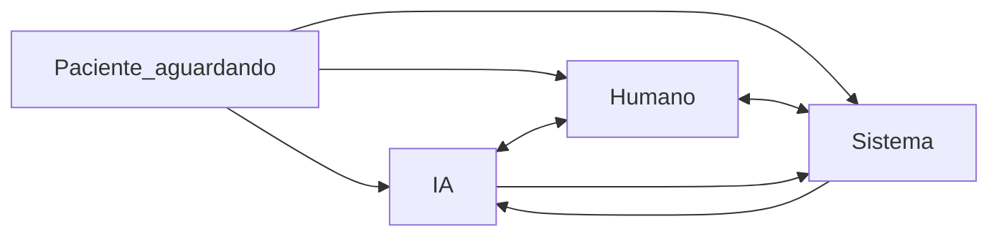
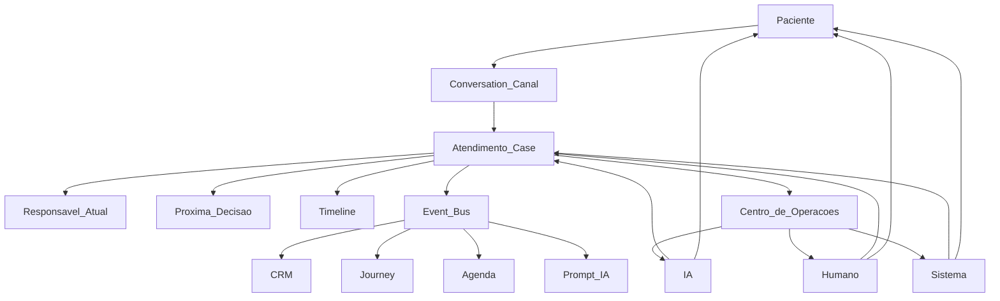

# Sistema Operacional de Atendimento — Auditoria Consolidada

**Versão:** 1.0  
**Data:** 17 de julho de 2026  
**Status:** diagnóstico operacional, constituição e arquitetura-alvo

## Resumo executivo

O produto da Flowmedi não é “uma IA que conversa no WhatsApp”.

É:

> **A clínica finalmente consegue operar todo o atendimento em um único lugar, independentemente de quem respondeu: IA ou humano.**

WhatsApp, CRM e agenda são interfaces. IA, humanos e automações são atores. Todos devem manipular a mesma entidade operacional: o **Atendimento (Case)**.

O problema central encontrado não é falta de funcionalidades isoladas. É a quebra de continuidade entre conversa, CRM, agenda, IA e equipe humana. Hoje essas áreas mantêm estados relacionados, mas não uma história operacional única.

As principais rupturas são:

1. O responsável pelo atendimento é inferido por flags diferentes e pode ficar ambíguo.
2. Encaminhar uma conversa para uma secretária não garante que a IA seja pausada.
3. A atividade do WhatsApp atualiza o lead principalmente no primeiro contato, não continuamente.
4. Alterações manuais no CRM não chegam explicitamente ao contexto da IA.
5. Existem duas noções concorrentes de próxima ação.
6. Não existe um ator operacional para compromissos como “me chama amanhã”.
7. Mensagens, eventos, agenda e histórico comercial não formam uma timeline única.
8. A secretária trabalha alternando entre WhatsApp, agenda, leads e jornada.

A arquitetura proposta introduz:

- **Atendimento (Case)** como fonte da verdade;
- **Responsável Atual** como conceito obrigatório;
- **Próxima Decisão** com responsável e prazo;
- **Decision Map** antes do Event Map;
- **Event Bus** para propagar consequências;
- **Centro de Operações** como superfície diária;
- **Filosofia do Atendimento** como constituição do produto.

---

## 1. Pergunta-guia

Durante toda decisão de produto, fluxo, tela ou implementação:

> **Quem deveria tomar a próxima decisão?**

Não apenas “qual é o próximo passo”. É necessário definir **quem decide**.

Isso leva à segunda pergunta:

> **Quem é o Responsável Atual do caso?**

Se a resposta for “ninguém” ou “os dois”, existe uma ruptura operacional.

Exemplos:

| Situação | Pergunta operacional |
|----------|----------------------|
| Paciente quer agendar | IA, humano, CRM ou agenda decide? |
| Paciente quer cancelar | Quem pode autorizar e executar? |
| Paciente pede orçamento | IA informa, humano negocia ou sistema cria? |
| Paciente pede contato amanhã | Quem registra, lembra e executa? |

---

## 2. Conceitos de primeira classe

### 2.1 Atendimento (Case)

Unidade operacional que reúne:

- participante (lead e/ou paciente);
- canais vinculados;
- contexto clínico relevante;
- estado da conversa;
- responsável atual;
- próxima decisão pendente;
- SLA e aging;
- estágio comercial;
- agenda e prontuário vinculados;
- notas, briefs e decisões;
- timeline de mensagens e eventos;
- status do atendimento.

Uma conversa é um canal. O Case é o **dossiê operacional**.

### 2.2 Responsável Atual

| Valor | Significado |
|-------|-------------|
| `IA` | Assistente conduz e pode falar |
| `Humano:<id>` | Pessoa nomeada conduz; IA permanece silenciosa |
| `Sistema` | Automação, cron, lembrete ou SLA conduz |
| `Paciente_aguardando` | A próxima decisão depende do paciente |

O Responsável Atual determina:

- quem pode falar;
- quem aparece na fila;
- quem carrega o SLA;
- se a IA pode processar o próximo inbound;
- quem deve tomar a próxima decisão.

### 2.3 Próxima Decisão

Não é somente texto de “próxima ação”. Deve conter:

```text
type
label
owner
due_at
created_by
context
```

O sistema operacional é uma fila de decisões pendentes com responsável, não uma lista de mensagens.

---

## 3. Diagnóstico conversacional

### Ciclo auditado

```text
Paciente → Webhook → Conversation → IA → Tools → CRM
→ Agenda → Humano → IA → Paciente
```

### Matriz de ownership

| Etapa | Dono atual | Quem altera | Quem consome | Quem decide hoje | Quem deveria decidir | Ruptura |
|-------|------------|------------|--------------|-------------------|-----------------------|---------|
| Mensagem inbound | Meta/webhook | Processador inbound | IA, menu ou humano | Flags `ai_*` | Responsável do Case | CRM não é atualizado continuamente |
| Conversation/ticket | `whatsapp_conversations` | Webhook, send, assign, cron | Inbox e IA | Status e flags | Case | Ticket não representa decisão |
| Estado da IA | `ai_state` | Runtime e tools | Próximo turno | IA local | IA lendo o Case | Journey pode ficar desatualizada |
| Tool de domínio | Appointments/patients | IA | Agenda, events, paciente | IA conforme stage | Autoridade definida na Filosofia | CRM recebe efeitos parciais |
| Lead/lifecycle | Pipeline | WPP inicial, UI, agenda | Leads, jornada, funil | Humano no kanban | Responsável do Case | Vínculo com conversa é por telefone |
| Appointment | Agenda | IA, secretária, médico | Agenda, events, journey | Quem executou | Responsável ou médico | Não define próxima decisão no Case |
| Handoff | Flags de IA e assignment | Tool, reply, comando | Inbox | Parcial/ambíguo | Novo Responsável + brief | Assign não garante pause |
| Próxima ação | Lead e journey | Persistida ou derivada | CRM | Frequentemente ninguém | Owner da pending decision | Dois sistemas concorrentes |
| Contexto da IA | Snapshot + `ai_state` | Cada turno | LLM | IA | Mesmo Case visto pelo humano | Notas CRM não entram explicitamente |
| “Me chama amanhã” | Não modelado | Ninguém | Ninguém | Ninguém | Sistema | Compromisso pode ser perdido |

### Onde a decisão desaparece

1. Mensagens posteriores ao primeiro contato não atualizam integralmente o CRM.
2. O assignment humano pode coexistir com IA ativa.
3. Lembretes solicitados pelo paciente não possuem responsável.
4. Ação sugerida pode existir sem executor.
5. Dois funcionários podem atuar sem claim explícito.
6. Falha de envio da IA pode ocorrer após avanço do estado.

### Evidências principais

- `lib/whatsapp/process-webhook-inbound.ts`
- `lib/leads/upsert-whatsapp-lead.ts`
- `lib/whatsapp-ai-state.ts`
- `app/api/whatsapp/assign-conversation/route.ts`
- `app/api/whatsapp/send/route.ts`
- `lib/chatbot/tools/execute.ts`
- `lib/contact-journey/next-actions.ts`

---

## 4. Decision Map

Eventos são consequências. Decisões desenham o fluxo.

### Paciente enviou mensagem

| ID | Momento | Opções | Hoje | Alvo | Falha se ninguém decidir |
|----|---------|--------|------|------|---------------------------|
| D1.1 | Inbound chegou | IA, humano, registrar ou spam | Flags implícitas | Router do Case | Mensagem sem SLA |
| D1.2 | Turno de resposta | Responder, esperar, escalar, agendar, cadastrar | IA ou humano | Responsável Atual | Paciente sem resposta |
| D1.3 | Quer consulta | Slots, dados, humano, qualificação | IA booking | IA por padrão ou humano por política | Lead parado |
| D1.4 | Quer cancelar | Cancelar, confirmar motivo, remarcar | Tool IA | Autoridade da Filosofia | Cancelamento ambíguo |
| D1.5 | Quer orçamento | Preço, quote ou comercial | Parcial | IA informa; humano fecha por padrão | Oportunidade perdida |
| D1.6 | “Me chama amanhã” | Lembrete, humano ou ignorar | Não confiável | Sistema + SLA | Ninguém lembra |

### IA terminou um turno

| ID | Momento | Opções | Hoje | Alvo |
|----|---------|--------|------|------|
| D2.1 | Após resposta | Aguardar, escalar, fechar, follow-up | Implícito | Pending decision explícita |
| D2.2 | Após tool | Confirmar, pedir form, encerrar comercial | Stage da IA | Decisão pós-tool no Case |
| D2.3 | Após falhas | Retry, fallback ou escalar | Handoff por falhas | Humano + brief técnico |
| D2.4 | Bot loop | Silenciar e escalar | Guard atual | Humano |

### Secretária abriu o caso

| ID | Momento | Opções | Hoje | Alvo |
|----|---------|--------|------|------|
| D3.1 | Abriu inbox | Responder, encaminhar, IA, vincular | Manual | Claim e owner humano |
| D3.2 | Precisa contexto | CRM, agenda, jornada, notas | Várias telas | Painel único do Case |
| D3.3 | Ação comercial | Estágio, nota, perdido, conversão | Leads/Jornada | Ops + Event Bus |
| D3.4 | Ação de agenda | Agendar, remarcar, status | Agenda separada | Execução no Ops ou retorno ao Case |
| D3.5 | Passagem | Colega, IA ou fechamento | Parcial | Transição com brief |
| D3.6 | Ligação externa | Registrar resultado | Nota ou nada | Decisão na timeline |

### Agenda e domínio clínico

| ID | Momento | Decisão alvo |
|----|---------|--------------|
| D4.1 | Consulta criada | Sistema aplica confirmação e formulários |
| D4.2 | Não confirmou | Sistema lembra; humano assume ao esgotar |
| D4.3 | Médico cancelou | Sistema avisa; humano remarca |
| D4.4 | Falta | Humano decide repescagem |

### CRM e jornada

| ID | Momento | Decisão alvo |
|----|---------|--------------|
| D5.1 | Lead parado | Fila comercial com owner |
| D5.2 | Suggested action | Pending decision executável |
| D5.3 | Duas próximas ações | Uma única pending decision vence |

### Colisão de atores

| ID | Situação | Regra |
|----|----------|-------|
| D6.1 | IA e humano ativos | Humano sempre vence |
| D6.2 | Paciente pede humano | Handoff conforme Filosofia |
| D6.3 | SLA do handoff expirou | Escalar ou reativar conforme política |

### Tipos universais de decisão

1. Responder.
2. Mutar domínio.
3. Mudar responsável.
4. Adiar ou lembrar.
5. Encerrar ou reabrir.
6. Atualizar estado comercial.
7. Não agir explicitamente.

---

## 5. Event Map

Contrato:

```text
decisão → evento → efeitos → atores avisados → próximo decisor
```

### WhatsApp e conversa

| ID | Evento | Efeito atual | Efeito alvo | Gap |
|----|--------|--------------|--------------|-----|
| E01 | `message_received` | Persiste mensagem e aciona IA/menu | Timeline, last contact e reavaliação do owner | Sem Case e idempotência |
| E02 | `conversation_created` | Routing e lead inicial | Criar Case e linkar pipeline | Lead só nasce aqui |
| E03 | `conversation_reopened` | Reabre ticket | Reabrir ou criar Case conforme Filosofia | Sem lifecycle do Case |
| E04 | `message_outbound_human` | Pausa IA | Owner humano + SLA | Parcialmente correto |
| E05 | `message_outbound_ai` | Mensagem e `ai_state` | Timeline e commit só após envio | Falha pode avançar state |
| E06 | `message_delivery_status` | Ignorado | Sent/delivered/read/failed + retry | Gap total |
| E07 | `ai_handoff` | Flags e routing | Owner humano/pool + reason + brief | Sem claim/SLA |
| E08 | `ai_paused_by_human_reply` | Pausa IA | Owner humano | Funciona parcialmente |
| E09 | `ai_reactivated` | Limpa handoff | Owner IA + brief no prompt | Sem brief obrigatório |
| E10 | `ai_opt_out` | Bloqueia automação | Owner humano até ATIVAR | Parcial |
| E11 | `conversation_assigned` | Apenas assignee | Pause IA + owner humano | Bug crítico |
| E12 | `conversation_closed_expired` | Fecha ticket | Atualiza estado do Case | Link CRM fraco |
| E13 | `lead_upserted_from_whatsapp` | Lead novo | Case com `pipeline_id` | Histórico pode falhar |
| E14 | `last_contact_bumped` | Parcial | Todo inbound | Não ocorre sempre |

### IA para domínio

| ID | Evento | Efeito alvo no Case |
|----|--------|---------------------|
| E20 | `patient_registered` | Vincular paciente e atualizar lifecycle |
| E21 | `patient_intake_updated` | Atualizar contexto clínico |
| E22 | `appointment_created` | Vínculo agenda + próxima confirmação |
| E23 | `appointment_confirmed` | Próxima decisão pré-consulta |
| E24 | `appointment_canceled` | Remarcar ou encerrar oportunidade |
| E25 | `appointment_rescheduled` | Atualizar agenda e timeline |
| E26 | `appointment_completed` | Fluxo pós-consulta |
| E27 | `appointment_no_show` | Decisão de repescagem |
| E28 | `check_in_performed` | Atualizar journey de consulta |
| E29 | `quote_sent` | Próxima decisão comercial |
| E30 | `form_linked/form_reminder` | Aguardar paciente |
| E31 | `public_form_completed` | Sync imediato do Case |
| E32 | `transfer_to_human` | Handoff com brief |

### CRM e humano para IA

| ID | Evento | Alvo | Gap atual |
|----|--------|------|-----------|
| E40 | `pipeline_stage_changed` | Invalidar journey IA e atualizar Case | IA não é avisada |
| E41 | `pipeline_note_added` | Nota operacional no prompt | Nota não chega à IA |
| E42 | `lead_marked_lost` | Encerrar comercialmente | Parcial |
| E43 | `lead_converted_patient` | Vincular patient ao Case | Match indireto |
| E44 | `journey_suggested_action_changed` | Pending decision persistida | Hoje é derivada |
| E45 | `repescagem_suggested` | Decisão humana com owner | Sem link WPP direto |

### Sistema, SLA e memória

| ID | Evento | Alvo | Gap atual |
|----|--------|------|-----------|
| E50 | `followup_due` | Sistema executa e reassina owner | Parcial |
| E51 | `handoff_sla_elapsed` | Escala ou reativa por política | Sem claim explícito |
| E52 | `reminder_call_tomorrow` | Sistema agenda e executa | Não existe |
| E53 | `post24h_limit_blocked` | Alertar responsável | Parcial |

### Cadeias críticas

**Mensagem recebida**

```text
message_received → last_contact → owner router → pending decision
→ SLA → Centro de Operações
```

**IA agendou**

```text
appointment_created → event/template → lifecycle/journey
→ timeline Case → aguardar confirmação/formulário
```

**Humano mudou o CRM**

```text
pipeline_stage_changed → Case → invalidar estado IA
→ prompt atualizado → próxima resposta coerente
```

---

## 6. Diagnóstico do CRM

### Propósito das superfícies

| Superfície | Pergunta respondida | Papel | Classificação |
|------------|---------------------|-------|---------------|
| Pipeline CRM | Como estão os funis e comparecimento? | Admin | Analytics |
| Centro de Leads | O que faço com este lead? | Secretária/admin | Híbrido |
| Jornada | O que deve acontecer agora? | Secretária | Operacional |
| Centro de Jornada | Quem precisa agir? | Secretária/admin | Operacional |
| WhatsApp | O que o paciente falou? | Secretária | Operacional |
| Agenda | Quando e com quem? | Secretária/médico | Operacional |
| Captação | Como configuramos entradas? | Admin | Setup |
| Diagnósticos da IA | A IA está saudável? | Admin | Diagnóstico técnico |

### Conclusões

1. Pipeline é ferramenta de gestão, não posto diário da secretária.
2. WhatsApp, jornada, leads e agenda são superfícies operacionais fragmentadas.
3. `next_action` do lead e `suggestedAction` da jornada competem.
4. Centro de Leads está fora da navegação conceitual do CRM.
5. As superfícies operacionais devem convergir no Centro de Operações.

### Decisão de produto

- **Manter separado:** funis/KPIs, captação e diagnósticos.
- **Consolidar:** chat, handoff, journey pendente, próxima decisão, contexto CRM e resumo da agenda.

---

## 7. Diagnóstico operacional

### A secretária hoje

```text
WhatsApp → CRM/Leads → Agenda → Jornada → WhatsApp → Agenda
```

### Fluxo alvo

```text
Centro de Operações
→ fila por owner/decisão/SLA
→ claim
→ decidir
→ executar
→ passar responsabilidade ou encerrar
```

### Wireflow

```text
┌──────────────────┬─────────────────────────────┬────────────────────┐
│ FILAS            │ ATENDIMENTO                 │ CONTEXTO           │
│ Preciso decidir  │ Timeline unificada          │ Responsável atual  │
│ IA conduzindo    │ Chat WhatsApp               │ Próxima decisão    │
│ Sistema/SLA      │ Composer autorizado         │ Estágio comercial  │
│ Paciente aguarda │ Claim / Pausar / Devolver   │ Agenda vinculada   │
│ Aging > SLA      │ Transferir / Fechar         │ Notas e briefs     │
└──────────────────┴─────────────────────────────┴────────────────────┘
```

### Filas

| Fila | Critério | Decisor |
|------|----------|---------|
| Preciso decidir | Owner humano + pending decision | Humano |
| IA conduzindo | Owner IA | IA com supervisão |
| Sistema | Owner Sistema e due | Automação |
| Paciente aguardando | Owner paciente | Paciente |
| Aging | SLA expirado | Escala conforme Filosofia |

### Feito do dia

- zero handoff sem claim acima do SLA;
- zero decisão humana órfã;
- todo Case aberto com owner;
- todo lembrete futuro sob responsabilidade do Sistema.

---

## 8. Colaboração IA + humano

### Estado atual e alvo

| Questão | Hoje | Alvo |
|---------|------|------|
| Quem conduz? | Inferido por várias flags | Owner explícito |
| Quem fala? | IA por flags; humano sempre | Owner; fala humana assume o Case |
| Quem pausa? | Reply e handoff, mas não todo assign | Toda saída do owner IA |
| Quem devolve? | Vários caminhos | Humano/Sistema com brief |
| Quem sabe o contexto? | IA e humano veem fontes distintas | Ambos leem o Case |
| Quem decide? | Implícito ou ausente | Pending decision |

### Máquina de estados



### Protocolo de passagem

1. Registrar decisão `change_owner`.
2. Atualizar o Responsável Atual.
3. Gravar brief: motivo, realizado e pendente.
4. Emitir evento.
5. Atualizar filas.
6. Se o destino for IA, carregar brief e Case no prompt.

### Regra de ouro

> **Humano sempre vence a IA.**

Ao responder, claimar ou assumir, o humano vira responsável e a IA silencia imediatamente.

---

## 9. Diagnóstico de continuidade

### Veredito

Hoje existem vários sistemas acoplados por telefone e e-mail:

- mensagens e estado IA;
- pipeline e histórico comercial;
- agenda e eventos;
- journey derivada;
- assignment e handoff.

Não existe uma história operacional única.

### Checklist

| Requisito | Hoje | Alvo |
|-----------|------|------|
| Timeline única | Fragmentada | Timeline do Case |
| Owner sempre definido | Não | Campo obrigatório |
| Próxima decisão única | Duas noções | Pending decision |
| Vínculo comercial | Indireto | `pipeline_id` |
| Vínculo clínico | Parcial | Patient e appointments |
| Contexto IA/humano | Diferente | Mesmo Case |
| Troca de ator | Sem brief | Brief obrigatório |
| Troca de funcionário | Sem claim forte | Claim + timeline |

### Modelo conceitual do Case

```text
Case
  id
  clinic_id
  status
  participant
  conversation_id
  pipeline_id
  patient_id
  appointment_ids
  owner
  pending_decision
  commercial_stage
  clinical_context
  operator_notes
  briefs
  sla_due_at
  timeline
  decision_history
```

### Regras

1. Toda mensagem, mutação CRM, agenda e owner escreve no Case.
2. A IA hidrata o prompt a partir do Case.
3. O humano vê o mesmo Case no Centro de Operações.
4. Fechar Case não apaga conversa.

---

## 10. Filosofia do Atendimento — Constituição

### Artigo I — Propósito

1. A Flowmedi opera todo atendimento em um único lugar.
2. Interfaces representam o Case, não realidades paralelas.
3. Decisões precedem eventos.

### Artigo II — O Case

Todo Case possui:

- Responsável Atual;
- zero ou uma próxima decisão pendente;
- timeline append-only.

O Case prevalece em conflitos de estado.

### Artigo III — Responsável Atual

1. Nunca é ambíguo.
2. Humano sempre vence a IA.
3. Assign humano é mudança de owner e pausa da IA.
4. Devolver à IA exige brief.

### Artigo IV — Início e fim

**Criação:** primeiro contato WhatsApp, lead acionável por formulário/site ou criação manual.

**Mesmo Case:** enquanto estiver aberto ou dentro da janela configurada de reabertura.

**Novo Case:** Case anterior fechado e nova intenção distinta após período frio, sugerido em 30 dias, ou decisão humana.

**Fechamento:**

- humano responsável ou admin pode fechar;
- IA sugere, mas não fecha por padrão;
- Sistema pode fechar por timeout configurado;
- todo fechamento possui motivo.

Fechar ticket WhatsApp não equivale automaticamente a fechar Case.

### Artigo V — Condução padrão

1. Com assistente ativo, owner inicial é IA, salvo routing humano.
2. Sem assistente, owner inicial é pool humano.
3. Prioridade: humano → pedido por humano → Sistema → IA.

### Artigo VI — Pedido de ator

- Paciente pode pedir humano sempre.
- Fora de horário, Sistema registra e informa a janela.
- Reclamação grave gera handoff sem retomada automática curta.
- Secretária pode devolver à IA se não houver opt-out e fornecer brief.
- IA transfere por pedido, falhas, loop ou política.
- Sistema executa lembretes e reassina o owner.

### Artigo VII — Memória e SLA

- “Me chama amanhã” cria owner Sistema e due date.
- SLA humano expirado escala ao pool/admin.
- SLA IA expirado gera fallback ou handoff.
- Falha do Sistema possui retry limitado e escala humana.
- Opt-out impede owner IA.

### Artigo VIII — Autoridade

| Ação | IA | Condição |
|------|----|----------|
| Preço, FAQ e horários | Sim | Políticas da clínica |
| Cadastro mínimo | Sim | Confirmar ambiguidade |
| Agendamento | Sim | Paciente confirma slot |
| Remarcação | Sim | Paciente confirma |
| Cancelamento | Condicional | Motivo explícito e política |
| Orçamento formal | Condicional | Humano comercial por padrão |
| Marcar falta/realizada | Não | Humano ou médico |
| Lifecycle comercial | Sugerir/automatizar por fatos | Humano pode sobrescrever |
| Fechar Case | Não por padrão | Humano/admin |

### Artigo IX — Decisão e evento

Toda mutação relevante possui ator e decisão. Toda decisão pode produzir eventos. A UI mostra decisões pendentes.

### Artigo X — Conflitos

1. Humano prevalece sobre IA.
2. Case prevalece após sincronização.
3. Primeiro claim humano vence.
4. Conflito não resolvível é encaminhado a humano.

### Artigo XI — Emendas

Mudanças desta constituição exigem:

1. atualização versionada deste documento;
2. revisão dos Decision e Event Maps;
3. registro explícito da nova regra de produto.

---

## 11. Arquitetura Operacional Alvo



### Componentes

#### Case Store

Fonte da verdade operacional. Inicialmente pode ser construído sobre:

| Conceito | Fonte atual |
|----------|-------------|
| Conversa | `whatsapp_conversations` |
| Patient | `patient_id` existente |
| Lead | Novo `pipeline_id` |
| Owner | Flags IA + assignee, depois campo nativo |
| Pending decision | Unificação journey/next action |
| Timeline | Mensagens, events e histories |
| Briefs | Novo armazenamento |

#### Decision Engine

API interna sugerida:

```text
recordDecision(caseId, actor, decisionType, payload)
setOwner(caseId, owner, brief?)
setPendingDecision(caseId, decision | null)
closeCase(caseId, reason)
reopenCase(caseId, reason)
```

#### Event Bus

```text
emit(decisionId, eventType, payload)
```

Handlers:

- CRM lifecycle;
- invalidação de journey/IA;
- agenda;
- templates WhatsApp;
- fila operacional;
- contexto do prompt.

#### Centro de Operações

Reúne:

- filas por owner, decisão e SLA;
- chat;
- timeline;
- contexto CRM;
- agenda resumida;
- claim;
- handoff;
- brief;
- encerramento.

#### Atores

| Ator | Alvo |
|------|------|
| IA | Lê/escreve Case e só atua como owner |
| Humano | Trabalha no Centro de Operações |
| Sistema | Executa lembretes, SLA e follow-ups |

### Modelo lógico sugerido

```text
cases
  id, clinic_id, status, owner_type, owner_id,
  pipeline_id, patient_id, conversation_id,
  pending_decision jsonb, commercial_stage,
  sla_due_at, created_at, closed_at

case_timeline_entries
  id, case_id, kind, actor, payload, created_at

case_briefs
  id, case_id, from_owner, to_owner, body, created_at
```

---

## 12. Backlog derivado

### P0 — Integridade do responsável

1. Assign humano sempre pausa IA e registra handoff.
2. Unificar reply humano e assign no mesmo protocolo.
3. Expor Responsável Atual na interface.

### P1 — Case mínimo e Event Bridge

1. Adicionar `pipeline_id` à conversa e realizar backfill.
2. Criar `recordDecision` e `emit`.
3. Cobrir inbound, handoff, appointment, patient e pipeline stage.
4. Invalidar journey da IA quando CRM mudar.
5. Adicionar contexto operacional ao prompt.

### P2 — Centro de Operações

1. Criar `/dashboard/operacoes`.
2. Filas por owner, SLA e pending decision.
3. Claim e devolução à IA com brief.
4. Links bidirecionais com Leads e Jornada.

### P3 — Sistema como ator

1. Modelar “me chama amanhã”.
2. Unificar `next_action` e `suggestedAction`.
3. Persistir `wamid` e status de entrega Meta.

### P4 — Analytics separado

1. Pipeline CRM permanece analytics.
2. Centro de Operações permanece execução diária.

---

## 13. O que não fazer

- Criar mais telas operacionais paralelas.
- Integrar WhatsApp e CRM sem introduzir Case.
- Deixar próxima ação sem responsável.
- Permitir IA e humano conduzindo juntos.
- Usar eventos sem registrar a decisão de origem.
- Usar assignment apenas como rótulo visual.

---

## 14. Critérios de sucesso

Qualquer pessoa do time deve responder:

1. O que é um Atendimento?
2. Quem é o Responsável Atual?
3. Quem deveria tomar a próxima decisão?
4. Qual decisão está pendente?
5. Quais eventos ela dispara?
6. Onde a secretária trabalha?
7. O que acontece quando IA e humano discordam?

Critérios operacionais:

- todo Case aberto tem owner;
- não existem handoffs órfãos acima do SLA;
- não existem decisões humanas órfãs;
- IA e humano leem o mesmo contexto;
- toda mudança CRM relevante chega ao prompt;
- toda ação futura tem owner Sistema;
- operação diária ocorre majoritariamente no Centro de Operações.

---

## 15. Relação com documentos existentes

| Documento | Papel |
|-----------|-------|
| `PIPELINE-AGENTE-VIRTUAL-FLUXO-COMPLETO.md` | Runtime e ferramentas da IA |
| `WHATSAPP-AUDITORIA-COBERTURA-E-FIDELIDADE.md` | Canal e templates |
| `FLOWMEDI-VISAO-PRODUTO-E-ARQUITETURA.md` | Visão ampla do produto |
| `FLUXO-OPERACIONAL-*.md` | Histórico dos fluxos anteriores |

Este documento passa a ser o **documento mestre do Sistema Operacional de Atendimento**.

