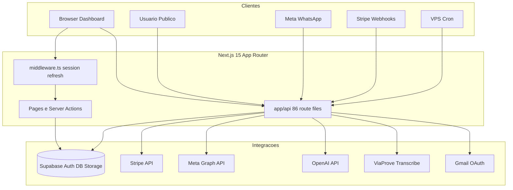

# Auditoria de Segurança — Flowmedi

**Data:** 27 de junho de 2026  
**Escopo:** Análise estática do repositório Flowmedi (Next.js 15 + Supabase + Stripe + Meta WhatsApp)  
**Metodologia:** Revisão de código, mapeamento de superfície de ataque, OWASP Top 10, npm audit  
**Validação operacional:** `CRON_SECRET` confirmado em produção pelo responsável. Endpoint `/api/whatsapp/webhook/debug` — decisão pendente.

---

# Resumo Executivo

## Nível geral de segurança

**Médio**, com **riscos altos pontuais** em endpoints públicos, webhooks e dependências do framework.

A aplicação adota uma arquitetura de defesa em profundidade razoável: Supabase Auth com cookies HTTP-only, RLS extensivo por `clinic_id`, helpers de autorização centralizados e verificação de assinatura no webhook Stripe. Porém, existem falhas de design fail-open, endpoints de debug expostos, webhooks Meta sem validação de assinatura POST, e o framework Next.js está em versão com CVEs críticas conhecidas.

## Principais riscos

| # | Risco | Severidade |
|---|-------|------------|
| 1 | Next.js 15.0.5 com 20+ CVEs (middleware bypass, SSRF, DoS Server Actions) | Crítico |
| 2 | `/api/whatsapp/webhook/debug` público — vazamento de PII | Crítico |
| 3 | Webhook Meta WhatsApp POST sem `X-Hub-Signature-256` | Alto |
| 4 | `/api/process-public-form-event` sem autenticação — abuso de envio | Alto |
| 5 | Security headers ausentes (CSP, HSTS, X-Frame-Options) | Alto |
| 6 | Buckets Supabase públicos para mídia clínica/financeira | Alto |
| 7 | Padrão fail-open em rotas cron se `CRON_SECRET` ausente | Médio (mitigado em prod) |

## Classificação geral

| Critério | Avaliação |
|----------|-----------|
| Autenticação | Adequada (Supabase SSR) |
| Autorização | Boa com ressalvas (RLS + layouts; gaps em server actions) |
| Exposição de dados | Riscos em debug endpoint e storage público |
| Configuração | Insuficiente (headers, fail-open cron) |
| Dependências | Crítico (Next.js desatualizado) |

## Veredicto

### **Não Aprovado para Produção**

**Justificativa:** Existem achados **Críticos** (V-001, V-002) e **Altos** (V-003 a V-009) que devem ser corrigidos antes do go-live. O `CRON_SECRET` configurado em produção mitiga o exploit ativo de V-006, mas o padrão fail-open permanece como risco de misconfiguração.

**Após correção dos 7 bloqueadores P0 listados no Plano de Correção:** classificação esperada **Aprovado com Ressalvas** (storage público, rate limit in-memory, logs PII, XSS em previews HTML).

---

# Arquitetura

## Visão geral

Flowmedi é uma aplicação **Next.js 15 App Router** hospedada na Vercel, com banco de dados, autenticação e storage no **Supabase**. Integrações externas incluem Stripe (billing), Meta Graph API (WhatsApp Business), Google Gmail OAuth, OpenAI (assistente virtual) e ViaProve (transcrição de áudio). Jobs agendados rodam via VPS cron contra rotas `/api/cron/*`.

## Integrações

| Serviço | Finalidade | Arquivos-chave | Variáveis de ambiente |
|---------|------------|----------------|----------------------|
| Supabase | Auth, DB, Storage | `lib/supabase/*` | `NEXT_PUBLIC_SUPABASE_URL`, `NEXT_PUBLIC_SUPABASE_ANON_KEY`, `SUPABASE_SERVICE_ROLE_KEY` |
| Stripe | Assinaturas, checkout, portal | `lib/stripe.ts`, `app/api/stripe/*` | `STRIPE_SECRET_KEY`, `STRIPE_WEBHOOK_SECRET`, `STRIPE_PUBLISHABLE_KEY` |
| Meta WhatsApp | OAuth, mensagens, templates | `lib/comunicacao/whatsapp.ts`, webhooks | `META_APP_ID`, `META_APP_SECRET`, `META_WHATSAPP_WEBHOOK_VERIFY_TOKEN` |
| Google Gmail | Envio de e-mail por clínica | `lib/comunicacao/email.ts` | `GOOGLE_CLIENT_ID`, `GOOGLE_CLIENT_SECRET` |
| OpenAI | Assistente virtual WhatsApp | `lib/virtual-assistant/openai-client.ts` | `OPENAI_API_KEY` |
| ViaProve | Transcrição de consultas | `lib/transcribe-api.ts` | `TRANSCRIBE_API_URL`, `TRANSCRIBE_API_KEY` |
| Vercel | Hosting, `waitUntil` async | — | `VERCEL_URL` |

## Autenticação

- **Provider:** Supabase Auth exclusivamente (sem NextAuth, sem JWT customizado).
- **Sessão:** Cookies HTTP-only gerenciados por `@supabase/ssr`.
- **Refresh:** Middleware chama `supabase.auth.getUser()` em cada request para validar/renovar tokens (`lib/supabase/middleware.ts`).
- **Login:** `app/entrar/login-form.tsx` — `signInWithPassword`.
- **Cadastro:** `app/criar-conta/signup-form.tsx` — `signUp` com `emailRedirectTo`.
- **Recuperação:** `app/esqueci-senha/forgot-form.tsx` — `resetPasswordForEmail`.
- **Logout:** `components/dashboard-nav-rail.tsx` — `signOut()`.
- **OAuth:** Apenas para integrações (Google Gmail, Meta WhatsApp), não para login de usuário.

**Importante:** O middleware (`middleware.ts`) **não redireciona** usuários não autenticados. Proteção ocorre em layouts de página e checks por rota API.

## Autorização

| Camada | Mecanismo | Arquivo |
|--------|-----------|---------|
| Roles | `admin`, `secretaria`, `medico`, `system_admin` | `profiles.role`, `supabase/migration-system-admin-role.sql` |
| Helpers API/páginas | `requireClinicAdmin`, `requireClinicMember`, `requireSystemAdmin` | `lib/auth-helpers.ts` |
| Layout dashboard | Auth + active + redirect system_admin | `app/dashboard/layout.tsx` |
| Sub-layouts módulo | RBAC por role (financeiro, CRM, etc.) | `app/dashboard/*/layout.tsx` |
| Plan gates | Features por plano (WhatsApp, audit, etc.) | `lib/plan-gates.ts` |
| Banco de dados | RLS por `clinic_id` | ~60+ migrations com `CREATE POLICY` |
| RPCs públicas | `SECURITY DEFINER` com validação interna | `supabase/functions-form-by-token.sql` |

---

# Inventário de APIs

**Total:** 79 arquivos `route.ts` únicos, ~95 handlers HTTP. Sem rotas legacy `pages/api`.

**Legenda de risco:** 🔴 Crítico · 🟠 Alto · 🟡 Médio · 🟢 Baixo · ⚪ Informativo

## Públicas — sem autenticação de usuário

| Endpoint | Método | Arquivo | Auth | Validação | Rate limit | Risco |
|----------|--------|---------|------|-----------|------------|-------|
| `/api/plans/pricing` | GET | `app/api/plans/pricing/route.ts` | Nenhuma | Filtro `show_on_pricing` + `is_active` | Não | 🟢 |
| `/api/stripe/config` | GET | `app/api/stripe/config/route.ts` | Nenhuma | Retorna publishable key | Não | 🟢 |
| `/api/stripe/price` | GET | `app/api/stripe/price/route.ts` | Nenhuma | Query `plan` | Não | 🟢 |
| `/api/public/booking/[slug]/catalog` | GET | `app/api/public/booking/[slug]/catalog/route.ts` | Nenhuma | Slug + site ativo | 60/IP/slug | 🟡 |
| `/api/public/booking/[slug]/slots` | GET | `app/api/public/booking/[slug]/slots/route.ts` | Nenhuma | procedureId, doctorId | 40/IP/slug | 🟡 |
| `/api/public/booking/[slug]/appointments` | POST | `app/api/public/booking/[slug]/appointments/route.ts` | Nenhuma | Campos obrigatórios | 10/5min/IP | 🟡 |
| `/api/public/contact/[slug]` | POST | `app/api/public/contact/[slug]/route.ts` | Nenhuma | RPC `submit_public_site_contact` | 5/5min/IP | 🟡 |
| `/api/public-suggestions` | GET, POST | `app/api/public-suggestions/route.ts` | Service role | Sanitize + cooldown IP | Cooldown | 🟡 |
| `/api/public-suggestions/[id]` | PATCH, DELETE | `app/api/public-suggestions/[id]/route.ts` | `edit_token` | Janela de edição | Não | 🟡 |
| `/api/public-suggestions/token/[token]` | GET, PATCH, DELETE | `app/api/public-suggestions/token/[token]/route.ts` | Token URL | Sanitize + janela | Não | 🟡 |
| `/api/process-public-form-event` | POST | `app/api/process-public-form-event/route.ts` | **Nenhuma** | `form_instance_id` string | Não | 🔴 |
| `/api/whatsapp/webhook/debug` | GET | `app/api/whatsapp/webhook/debug/route.ts` | **Nenhuma** | Nenhuma | Não | 🔴 |

## Webhooks

| Endpoint | Método | Arquivo | Auth | Validação | Risco |
|----------|--------|---------|------|-----------|-------|
| `/api/stripe/webhook` | POST | `app/api/stripe/webhook/route.ts` | Stripe signature | `constructEvent` + secret | 🟢 |
| `/api/integrations/whatsapp/webhook` | GET | `app/api/integrations/whatsapp/webhook/route.ts` | `hub.verify_token` | Challenge Meta | 🟡 |
| `/api/integrations/whatsapp/webhook` | POST | mesmo | **Nenhuma assinatura** | JSON parse | 🔴 |
| `/api/whatsapp/webhook` | GET, POST | `app/api/whatsapp/webhook/route.ts` | Duplicata legacy | Igual acima | 🔴 |

## Cron e internal

| Endpoint | Método | Arquivo | Auth | Validação | Risco |
|----------|--------|---------|------|-----------|-------|
| `/api/cron/process-whatsapp-ai` | GET | `app/api/cron/process-whatsapp-ai/route.ts` | Bearer/`?secret=` CRON_SECRET | Fail-open se secret ausente | 🟠 |
| `/api/cron/financial-recurrence` | GET | `app/api/cron/financial-recurrence/route.ts` | CRON_SECRET | Fail-open | 🟠 |
| `/api/cron/check-compliance` | GET | `app/api/cron/check-compliance/route.ts` | CRON_SECRET | Fail-open; `?clinic_id=` opcional | 🟠 |
| `/api/cron/close-whatsapp-expired` | GET | `app/api/cron/close-whatsapp-expired/route.ts` | CRON_SECRET | Fail-open | 🟠 |
| `/api/cron/virtual-assistant-confirmations` | GET | `app/api/cron/virtual-assistant-confirmations/route.ts` | CRON_SECRET | Fail-open | 🟠 |
| `/api/internal/process-whatsapp-ai` | POST | `app/api/internal/process-whatsapp-ai/route.ts` | CRON_SECRET; bypass em non-prod | `conversationId` | 🟠 |

## System admin (`requireSystemAdmin`)

| Endpoint | Método | Arquivo | Risco |
|----------|--------|---------|-------|
| `/api/admin/plans` | POST | `app/api/admin/plans/route.ts` | 🟢 |
| `/api/admin/plans/[id]` | PUT, DELETE | `app/api/admin/plans/[id]/route.ts` | 🟢 |
| `/api/admin/clinics/[id]` | PUT | `app/api/admin/clinics/[id]/route.ts` | 🟢 |
| `/api/admin/reset-stripe` | POST | `app/api/admin/reset-stripe/route.ts` | 🟢 |

## Stripe — clinic admin (`getUser` + `role === admin`)

| Endpoint | Método | Arquivo | Risco |
|----------|--------|---------|-------|
| `/api/stripe/subscription` | GET | `app/api/stripe/subscription/route.ts` | 🟢 |
| `/api/stripe/invoices` | GET | `app/api/stripe/invoices/route.ts` | 🟢 |
| `/api/stripe/create-checkout-session` | POST | `app/api/stripe/create-checkout-session/route.ts` | 🟢 |
| `/api/stripe/create-payment-intent` | POST | `app/api/stripe/create-payment-intent/route.ts` | 🟢 |
| `/api/stripe/confirm-subscription` | POST | `app/api/stripe/confirm-subscription/route.ts` | 🟢 |
| `/api/stripe/create-portal-session` | POST | `app/api/stripe/create-portal-session/route.ts` | 🟢 |
| `/api/stripe/change-plan` | POST | `app/api/stripe/change-plan/route.ts` | 🟢 |
| `/api/stripe/checkout-change-plan` | POST | `app/api/stripe/checkout-change-plan/route.ts` | 🟢 |
| `/api/stripe/cancel-subscription` | POST | `app/api/stripe/cancel-subscription/route.ts` | 🟢 |
| `/api/stripe/resume-subscription` | POST | `app/api/stripe/resume-subscription/route.ts` | 🟢 |

## Integrações — clinic admin + plan gates

| Endpoint | Método | Arquivo | Auth | Risco |
|----------|--------|---------|------|-------|
| `/api/integrations` | GET | `app/api/integrations/route.ts` | `requireClinicAdmin` | 🟢 |
| `/api/integrations/google/auth` | GET | `app/api/integrations/google/auth/route.ts` | Admin + email plan | 🟢 |
| `/api/integrations/google/callback` | GET | `app/api/integrations/google/callback/route.ts` | Session + state | 🟢 |
| `/api/integrations/google/disconnect` | POST | `app/api/integrations/google/disconnect/route.ts` | Admin + email plan | 🟢 |
| `/api/integrations/email/test` | POST | `app/api/integrations/email/test/route.ts` | Admin + email plan | 🟢 |
| `/api/integrations/whatsapp/auth` | GET | `app/api/integrations/whatsapp/auth/route.ts` | Admin + WhatsApp plan | 🟢 |
| `/api/integrations/whatsapp/callback` | GET | `app/api/integrations/whatsapp/callback/route.ts` | Session + state | 🟢 |
| `/api/integrations/whatsapp/complete-embedded` | POST | `app/api/integrations/whatsapp/complete-embedded/route.ts` | Admin + WhatsApp plan | 🟢 |
| `/api/integrations/whatsapp/disconnect` | POST | `app/api/integrations/whatsapp/disconnect/route.ts` | Admin | 🟢 |
| `/api/integrations/whatsapp/test` | POST | `app/api/integrations/whatsapp/test/route.ts` | Admin + WhatsApp plan | 🟡 |
| `/api/integrations/whatsapp/billing-status` | GET | `app/api/integrations/whatsapp/billing-status/route.ts` | Admin + WhatsApp plan | 🟢 |
| `/api/integrations/whatsapp/meta-assets` | GET | `app/api/integrations/whatsapp/meta-assets/route.ts` | Admin + WhatsApp plan | 🟢 |
| `/api/integrations/whatsapp/set-phone-id` | POST | `app/api/integrations/whatsapp/set-phone-id/route.ts` | Admin + WhatsApp plan | 🟢 |
| `/api/integrations/whatsapp-simple/*` | GET, POST | `app/api/integrations/whatsapp-simple/*/route.ts` | Admin + WhatsApp plan | 🟢 |

## Pacientes e consultas — clinic member

| Endpoint | Método | Arquivo | Auth | RBAC | Risco |
|----------|--------|---------|------|------|-------|
| `/api/patients/search` | GET | `app/api/patients/search/route.ts` | `requireClinicMember` | — | 🟢 |
| `/api/patients/by-phone` | GET | `app/api/patients/by-phone/route.ts` | `requireClinicMember` | — | 🟢 |
| `/api/patients/custom-fields` | GET | `app/api/patients/custom-fields/route.ts` | `requireClinicMember` | — | 🟢 |
| `/api/appointments/[id]/transcribe` | POST | `app/api/appointments/[id]/transcribe/route.ts` | `requireClinicMemberWithRole` | medico/admin/secretaria | 🟡 |
| `/api/appointments/[id]/transcriptions` | GET | `app/api/appointments/[id]/transcriptions/route.ts` | `requireClinicMemberWithRole` | — | 🟢 |
| `/api/transcribe/jobs/[transcriptionId]` | GET | `app/api/transcribe/jobs/[transcriptionId]/route.ts` | `requireClinicMemberWithRole` | Ownership check | 🟢 |

## WhatsApp — dashboard

| Endpoint | Método | Arquivo | Auth | RBAC | Risco |
|----------|--------|---------|------|------|-------|
| `/api/whatsapp/conversations` | GET | `app/api/whatsapp/conversations/route.ts` | Member + role | Admin/secretaria filter | 🟢 |
| `/api/whatsapp/messages` | GET | `app/api/whatsapp/messages/route.ts` | `requireClinicMember` | Clinic scope | 🟢 |
| `/api/whatsapp/unread-count` | GET | `app/api/whatsapp/unread-count/route.ts` | Member + role | — | 🟢 |
| `/api/whatsapp/secretaries` | GET | `app/api/whatsapp/secretaries/route.ts` | `requireClinicMember` | — | 🟢 |
| `/api/whatsapp/usage-limit` | GET | `app/api/whatsapp/usage-limit/route.ts` | `requireClinicMember` | — | 🟢 |
| `/api/whatsapp/mark-viewed` | POST | `app/api/whatsapp/mark-viewed/route.ts` | Member | — | 🟢 |
| `/api/whatsapp/complete-conversation` | POST | `app/api/whatsapp/complete-conversation/route.ts` | Member | — | 🟢 |
| `/api/whatsapp/delete-conversation` | DELETE | `app/api/whatsapp/delete-conversation/route.ts` | Member | — | 🟢 |
| `/api/whatsapp/close-expired` | POST | `app/api/whatsapp/close-expired/route.ts` | Member | — | 🟢 |
| `/api/whatsapp/send` | POST | `app/api/whatsapp/send/route.ts` | Member + role | Admin/secretaria | 🟢 |
| `/api/whatsapp/link-patient` | POST | `app/api/whatsapp/link-patient/route.ts` | Member + role | Admin/secretaria | 🟢 |
| `/api/whatsapp/assign-conversation` | POST | `app/api/whatsapp/assign-conversation/route.ts` | Member + role | Admin/secretaria | 🟢 |
| `/api/whatsapp/routing-settings` | GET, POST | `app/api/whatsapp/routing-settings/route.ts` | `requireClinicAdmin` | Enum validation | 🟢 |
| `/api/whatsapp/assistant/diagnostics` | GET | `app/api/whatsapp/assistant/diagnostics/route.ts` | Admin | — | 🟡 |
| `/api/whatsapp/assistant/simulate` | POST | `app/api/whatsapp/assistant/simulate/route.ts` | Admin | — | 🟡 |
| `/api/whatsapp/assistant/process-now` | POST | `app/api/whatsapp/assistant/process-now/route.ts` | Admin | — | 🟡 |
| `/api/whatsapp/assistant/clear-queue` | POST | `app/api/whatsapp/assistant/clear-queue/route.ts` | Admin | — | 🟡 |
| `/api/whatsapp/assistant/reactivate-conversation` | POST | `app/api/whatsapp/assistant/reactivate-conversation/route.ts` | Admin | — | 🟡 |

---

# Inventário de Rotas

**Total:** 113 rotas únicas (`app/**/page.tsx`).

## Rotas públicas (sem login)

| Rota | Arquivo | Middleware | Proteção |
|------|---------|------------|----------|
| `/` | `app/page.tsx` | Session refresh | Nenhuma |
| `/entrar` | `app/entrar/page.tsx` | Session refresh | Nenhuma |
| `/criar-conta` | `app/criar-conta/page.tsx` | Session refresh | Nenhuma |
| `/esqueci-senha` | `app/esqueci-senha/page.tsx` | Session refresh | Nenhuma |
| `/precos` | `app/precos/page.tsx` | Session refresh | Nenhuma |
| `/termos-de-servico` | `app/termos-de-servico/page.tsx` | Session refresh | Nenhuma |
| `/politica-de-privacidade` | `app/politica-de-privacidade/page.tsx` | Session refresh | Nenhuma |
| `/exclusao-de-dados` | `app/exclusao-de-dados/page.tsx` | Session refresh | Nenhuma |
| `/sugestoes` | `app/sugestoes/page.tsx` | Session refresh | Nenhuma |
| `/acesso-removido` | `app/acesso-removido/page.tsx` | Session refresh | Nenhuma |
| `/edit/[token]` | `app/edit/[token]/page.tsx` | Session refresh | Token de sugestão |
| `/convite/[token]` | `app/convite/[token]/page.tsx` | Session refresh | Token de convite |
| `/f/[token]/**` | `app/f/[token]/page.tsx` + nested | Session refresh | RPC `get_form_by_token` |
| `/f/public/[slug]/**` | `app/f/public/[slug]/page.tsx` | Session refresh | Slug + template público |
| `/c/[slug]` | `app/c/[slug]/page.tsx` | Subdomain rewrite | Slug público |
| `/c/[slug]/agendar` | `app/c/[slug]/agendar/page.tsx` | Subdomain rewrite | Slug + booking API |

## Dashboard — autenticado (`app/dashboard/layout.tsx`)

**Middleware:** Session refresh  
**Layout guard:** `getUser()` → redirect `/entrar`; `system_admin` → `/admin/system`; `active === false` → `/acesso-removido`

| Grupo | Rotas | Proteção adicional |
|-------|-------|-------------------|
| Visão geral | `/dashboard` | Layout apenas |
| Agenda | `/dashboard/agenda`, `/dashboard/consulta`, `/dashboard/agenda/atendimento/[id]`, `/dashboard/agenda/consulta/[id]` | Layout; RBAC por página |
| Eventos | `/dashboard/eventos` | Layout |
| WhatsApp | `/dashboard/whatsapp` | Layout; plan gate WhatsApp |
| Mensagens | `/dashboard/mensagens/**` | Layout; admin-only em páginas |
| Contatos | `/dashboard/contatos/**` | Layout; medico bloqueado em actions |
| CRM | `/dashboard/crm/**` | Layout CRM: admin/secretaria |
| Atendimento | `/dashboard/atendimento`, `/dashboard/atendimentos/**` | Layout |
| Vendas | `/dashboard/vendas/**` | Layout vendas: admin/secretaria |
| Financeiro | `/dashboard/financeiro/**` | Layout financeiro: bloqueia medico |
| Estoque | `/dashboard/estoque/**` | Layout estoque: admin/secretaria |
| Serviços | `/dashboard/servicos-valores/**` | Layout |
| Planos tratamento | `/dashboard/planos-tratamento/**` | Layout |
| Configurações | `/dashboard/configuracoes/**` | Layout; admin em maioria |
| Equipe | `/dashboard/equipe` | Page: admin only |
| Auditoria | `/dashboard/auditoria` | Page: admin + plan gate |
| Perfil | `/dashboard/perfil` | Page: medico only |
| Onboarding | `/dashboard/onboarding` | Auth sem clinic_id |
| Legacy redirects | `/dashboard/pacientes`, `/dashboard/plano`, etc. | Redirects em `next.config.ts` |

## Admin sistema — `system_admin` (`requireSystemAdmin()` por página)

| Rota | Arquivo | Middleware | Proteção |
|------|---------|------------|----------|
| `/admin/system` | `app/admin/system/page.tsx` | Session refresh | `requireSystemAdmin()` |
| `/admin/system/clinicas` | `app/admin/system/clinicas/page.tsx` | Session refresh | `requireSystemAdmin()` |
| `/admin/system/clinicas/[id]` | `app/admin/system/clinicas/[id]/page.tsx` | Session refresh | `requireSystemAdmin()` |
| `/admin/system/planos` | `app/admin/system/planos/page.tsx` | Session refresh | `requireSystemAdmin()` |
| `/admin/system/planos/novo` | `app/admin/system/planos/novo/page.tsx` | Session refresh | `requireSystemAdmin()` |
| `/admin/system/planos/[id]` | `app/admin/system/planos/[id]/page.tsx` | Session refresh | `requireSystemAdmin()` |

**Risco:** Não existe `app/admin/layout.tsx` compartilhado — cada página deve chamar `requireSystemAdmin()` individualmente.

---

# Vulnerabilidades

## V-001 — Next.js 15.0.5 com CVEs críticas

| Campo | Detalhe |
|-------|---------|
| **Severidade** | Crítico |
| **Descrição** | Framework desatualizado com múltiplas vulnerabilidades conhecidas incluindo bypass de middleware, SSRF, DoS em Server Actions, exposição de source code e cache poisoning. |
| **Evidência** | `package.json` L27: `"next": "15.0.5"`. `npm audit` reporta 20+ advisories para Next.js 9.3.4–16.3.0-canary.5, incluindo GHSA-f82v-jwr5-mffw (Authorization Bypass in Middleware), GHSA-4342-x723-ch2f (SSRF via Middleware Redirect). |
| **Impacto** | DoS, bypass de autenticação, SSRF, exposição de código de Server Actions. |
| **Recomendação** | Atualizar para `next@>=15.5.19` e `eslint-config-next` correspondente. Executar testes de regressão completos após upgrade. |

## V-002 — Webhook debug público sem autenticação

| Campo | Detalhe |
|-------|---------|
| **Severidade** | Crítico |
| **Descrição** | Endpoint de diagnóstico expõe último payload Meta WhatsApp e eventos AI das últimas 24h para qualquer visitante. |
| **Evidência** | `app/api/whatsapp/webhook/debug/route.ts` L11-35: `GET()` sem auth; retorna `lastPayload`, `recentAiEvents` com `clinic_id`, `detail`, `conversation_id`. Comentário L8 referencia URL pública de produção. |
| **Impacto** | Vazamento de PII: telefones, nomes, conteúdo de mensagens, IDs de clínica e conversas. |
| **Recomendação** | Remover em produção ou proteger com `requireSystemAdmin()` + flag `ENABLE_WEBHOOK_DEBUG=true` apenas em staging. |

## V-003 — WhatsApp POST webhook sem verificação de assinatura Meta

| Campo | Detalhe |
|-------|---------|
| **Severidade** | Alto |
| **Descrição** | Requisições POST ao webhook Meta não validam header `X-Hub-Signature-256` com `META_APP_SECRET`. |
| **Evidência** | `app/api/integrations/whatsapp/webhook/route.ts` L45-69: parse JSON + `createServiceRoleClient()` sem verificação de assinatura. Duplicata em `app/api/whatsapp/webhook/route.ts`. |
| **Impacto** | Atacante pode injetar mensagens falsas, manipular conversas, disparar assistente AI, consumir quota Meta. |
| **Recomendação** | Implementar validação HMAC SHA256 conforme documentação Meta. Rejeitar POST com assinatura inválida antes de processar body. |

## V-004 — `/api/process-public-form-event` sem autenticação

| Campo | Detalhe |
|-------|---------|
| **Severidade** | Alto |
| **Descrição** | Qualquer caller com UUID válido de `form_instance_id` pode disparar envio automático de email/WhatsApp via service role. |
| **Evidência** | `app/api/process-public-form-event/route.ts` L12-54: POST sem auth; usa `createServiceRoleClient()` + `runAutoSendForEvent()`. |
| **Impacto** | Spam de pacientes, abuso de quota Gmail/Meta, custo financeiro, reputação da clínica. |
| **Recomendação** | Adicionar HMAC signed token gerado no submit do formulário, ou shared secret interno, ou mover lógica para trigger DB/Edge Function. |

## V-005 — Token verify Meta com fallback hardcoded

| Campo | Detalhe |
|-------|---------|
| **Severidade** | Alto |
| **Descrição** | Verify token padrão previsível se variável de ambiente não estiver configurada. |
| **Evidência** | `app/api/integrations/whatsapp/webhook/route.ts` L22: `process.env.META_WHATSAPP_WEBHOOK_VERIFY_TOKEN \|\| "flowmedi-verify"`. Mesmo em `app/api/whatsapp/webhook/route.ts`. |
| **Impacto** | Takeover de verificação de webhook se env ausente; registro malicioso de callback URL. |
| **Recomendação** | Remover fallback; falhar startup/deploy se `META_WHATSAPP_WEBHOOK_VERIFY_TOKEN` ausente. |

## V-006 — Padrão fail-open em rotas cron

| Campo | Detalhe |
|-------|---------|
| **Severidade** | Médio (mitigado: CRON_SECRET confirmado em prod) |
| **Descrição** | Cron routes aceitam requests sem token quando `CRON_SECRET` não está definido. |
| **Evidência** | `app/api/cron/process-whatsapp-ai/route.ts` L16-19: `if (expectedSecret && token !== expectedSecret)`. Padrão repetido em todos `/api/cron/*`. |
| **Impacto** | Se secret removido por erro de deploy: execução não autorizada de jobs com service role (AI, financeiro, compliance). |
| **Recomendação** | Fail-closed: `if (!expectedSecret \|\| token !== expectedSecret) return 401`. |

## V-007 — Internal route bypass em non-production

| Campo | Detalhe |
|-------|---------|
| **Severidade** | Alto (staging/preview) |
| **Descrição** | Rota interna de processamento AI permite acesso sem secret quando `NODE_ENV !== "production"`. |
| **Evidência** | `app/api/internal/process-whatsapp-ai/route.ts` L5-10: `if (!expectedSecret) return process.env.NODE_ENV !== "production"`. |
| **Impacto** | Preview deployments Vercel expostos publicamente podem processar conversas AI sem auth. |
| **Recomendação** | Sempre exigir secret; usar secret diferente por ambiente. |

## V-008 — Buckets públicos para dados sensíveis

| Campo | Detalhe |
|-------|---------|
| **Severidade** | Alto |
| **Descrição** | Mídia WhatsApp, fotos de pacientes e comprovantes financeiros usam URLs públicas previsíveis. |
| **Evidência** | `supabase/migration-whatsapp-media-bucket.sql` L17-21: política SELECT pública. `app/dashboard/pacientes/profile-actions.ts` L340: `getPublicUrl` em `patient-photos`. `app/dashboard/financeiro/receipt-actions.ts` L202: `getPublicUrl` em `receipts`. |
| **Impacto** | Acesso não autorizado a imagens clínicas, áudios WhatsApp e PDFs financeiros se path for descoberto. |
| **Recomendação** | Buckets privados + signed URLs com TTL curto; paths com UUID aleatório não derivável. |

## V-009 — Security headers ausentes

| Campo | Detalhe |
|-------|---------|
| **Severidade** | Alto |
| **Descrição** | Nenhum header de segurança configurado em Next.js ou Vercel. |
| **Evidência** | `next.config.ts`: apenas redirects. `vercel.json`: apenas build commands. Sem CSP, HSTS, X-Frame-Options, X-Content-Type-Options, Referrer-Policy. |
| **Impacto** | Clickjacking, XSS amplificado, MIME sniffing, downgrade HTTPS. |
| **Recomendação** | Adicionar `headers()` em `next.config.ts` ou config Vercel com CSP progressiva, HSTS, `X-Frame-Options: DENY`, `X-Content-Type-Options: nosniff`. |

## V-010 — Rate limit in-memory não distribuído

| Campo | Detalhe |
|-------|---------|
| **Severidade** | Médio |
| **Descrição** | Rate limiting usa `Map` local; ineficaz em deploy multi-instância Vercel. |
| **Evidência** | `lib/public-site/rate-limit.ts` L1-22: `const hits = new Map<string, ...>()`. |
| **Impacto** | Bypass de rate limit alternando instâncias; abuso de booking/contact APIs. |
| **Recomendação** | Upstash Redis, Vercel KV ou Supabase para rate limit distribuído. |

## V-011 — XSS via dangerouslySetInnerHTML

| Campo | Detalhe |
|-------|---------|
| **Severidade** | Médio |
| **Descrição** | HTML de templates de mensagem renderizado sem sanitização. |
| **Evidência** | `app/dashboard/eventos/eventos-client.tsx` L1077: `dangerouslySetInnerHTML={{ __html: item.body }}`. `components/comunicacao/message-preview.tsx` L96, L146. Email builders: `components/email-template-builder/*.tsx`. |
| **Impacto** | Stored XSS se admin inserir script malicioso em template; execução no browser de outros usuários da clínica. |
| **Recomendação** | Sanitizar com DOMPurify antes de renderizar; CSP com nonce. |

## V-012 — Logs verbose com PII em produção

| Campo | Detalhe |
|-------|---------|
| **Severidade** | Médio |
| **Descrição** | Webhooks e callbacks logam payloads completos, telefones, tax IDs e prefixos de tokens. |
| **Evidência** | `app/api/integrations/whatsapp/webhook/route.ts` L55-58: `JSON.stringify(parsed)`. `app/api/stripe/webhook/route.ts` ~L169: log `taxId`. `app/api/integrations/whatsapp-simple/callback/route.ts`: prefixo access token. |
| **Impacto** | PII em logs Vercel/VPS acessíveis a operadores; violação LGPD. |
| **Recomendação** | Redact campos sensíveis; log estruturado com níveis; desabilitar debug em prod. |

## V-013 — Server action sem auth inline

| Campo | Detalhe |
|-------|---------|
| **Severidade** | Médio |
| **Descrição** | Actions de dashboard médico aceitam `doctorId`/`clinicId` como parâmetros sem verificar sessão. |
| **Evidência** | `app/dashboard/medico-dashboard-actions.ts` L7-58: `getDoctorMetricsByPeriod(doctorId, clinicId)` — `createClient()` sem `getUser()`. |
| **Impacto** | IDOR potencial se RLS tiver gap; enumeração de métricas de outros médicos. |
| **Recomendação** | Adicionar `getUser()` + validar que `doctorId === user.id` ou role admin. |

## V-014 — Nav RBAC apenas client-side

| Campo | Detalhe |
|-------|---------|
| **Severidade** | Médio |
| **Descrição** | Menu oculta links por role, mas URLs diretas podem ser acessadas se página não tiver guard. |
| **Evidência** | `lib/dashboard-nav-config.ts`: filtro `roles[]` client-side. Nem todas as páginas têm layout guard (ex.: mensagens depende de page-level check). |
| **Impacto** | Broken access control via URL direta. |
| **Recomendação** | Garantir guard server-side em toda página restrita; considerar middleware matcher por prefixo. |

## V-015 — Admin sem layout compartilhado

| Campo | Detalhe |
|-------|---------|
| **Severidade** | Médio |
| **Descrição** | Rotas `/admin/system/**` protegidas individualmente; nova página pode ser criada sem guard. |
| **Evidência** | Ausência de `app/admin/layout.tsx`. Proteção em `app/admin/system/page.tsx` L12: `await requireSystemAdmin()`. |
| **Impacto** | Privilege escalation acidental em nova rota admin. |
| **Recomendação** | Criar `app/admin/layout.tsx` com `requireSystemAdmin()`. |

## V-016 — Duplicação de webhook routes

| Campo | Detalhe |
|-------|---------|
| **Severidade** | Médio |
| **Descrição** | Dois paths idênticos para webhook Meta. |
| **Evidência** | `app/api/whatsapp/webhook/route.ts` e `app/api/integrations/whatsapp/webhook/route.ts`. |
| **Impacto** | Superfície de ataque duplicada; manutenção inconsistente. |
| **Recomendação** | Deprecar `/api/whatsapp/webhook`; manter apenas `/api/integrations/whatsapp/webhook`. |

## V-017 — Dependências com vulnerabilidades high

| Campo | Detalhe |
|-------|---------|
| **Severidade** | Médio |
| **Descrição** | Pacotes transitivos com CVEs high (lodash, minimatch, flatted, ws, picomatch). |
| **Evidência** | `npm audit`: 11 vulnerabilidades (1 critical Next.js, 5 high, 5 moderate). |
| **Impacto** | DoS, prototype pollution em tooling (majoritariamente dev/build). |
| **Recomendação** | `npm audit fix`; upgrade Next.js resolve cascata. |

## V-018 — Sem biblioteca de validação estruturada

| Campo | Detalhe |
|-------|---------|
| **Severidade** | Baixo |
| **Descrição** | Validação manual inline; sem Zod/schemas. |
| **Evidência** | Ausência de `zod` em `package.json`; checks manuais em cada route. |
| **Impacto** | Inconsistência, mass assignment, inputs malformados. |
| **Recomendação** | Adotar Zod para APIs e server actions críticas. |

## V-019 — CRON_SECRET via query string

| Campo | Detalhe |
|-------|---------|
| **Severidade** | Baixo |
| **Descrição** | Secret aceito em `?secret=` além de Bearer header. |
| **Evidência** | `app/api/cron/process-whatsapp-ai/route.ts` L15; `.env.example` documenta query param. |
| **Impacto** | Secret em access logs de proxy/CDN. |
| **Recomendação** | Aceitar apenas header `Authorization: Bearer`. |

## V-020 — OAuth tokens em query string Meta Graph

| Campo | Detalhe |
|-------|---------|
| **Severidade** | Baixo |
| **Descrição** | Access tokens passados como query param em URLs Graph API. |
| **Evidência** | `app/api/integrations/whatsapp/callback/route.ts`: `access_token=${accessToken}` em URLs. |
| **Impacto** | Tokens em logs de servidor/proxy. |
| **Recomendação** | Usar header Authorization ou POST body. |

## V-021 — Edit tokens em localStorage

| Campo | Detalhe |
|-------|---------|
| **Severidade** | Baixo |
| **Descrição** | Tokens de edição de sugestões públicas persistidos em localStorage. |
| **Evidência** | `app/sugestoes/sugestoes-client.tsx`, `app/edit/[token]/token-edit-client.tsx`: key `suggestion_{id}`. |
| **Impacto** | XSS em outra origem poderia ler tokens; escopo limitado a feature pública. |
| **Recomendação** | Manter token apenas em URL ou sessionStorage com SameSite. |

## V-022 — deactivate_profile via browser RPC

| Campo | Detalhe |
|-------|---------|
| **Severidade** | Informativo |
| **Descrição** | Desativação de membros via RPC direto do client Supabase. |
| **Evidência** | `app/dashboard/equipe/equipe-client.tsx`: `supabase.rpc("deactivate_profile")`. RPC em `supabase/migration-equipe-invites.sql` L108-142: `SECURITY DEFINER` com checks admin + mesma clínica. |
| **Impacto** | Baixo — RPC valida role admin e clinic_id internamente. |
| **Recomendação** | Migrar para server action para consistência; RPC está corretamente protegida. |

---

# Revisão RLS e RPCs (amostra)

## Padrão base

`supabase/schema.sql`: todas as tabelas tenant-scoped com RLS via `clinic_id IN (SELECT clinic_id FROM profiles WHERE id = auth.uid())`.

## RPCs públicas (SECURITY DEFINER)

| RPC | Arquivo | Grant | Validação interna | Risco |
|-----|---------|-------|-------------------|-------|
| `get_form_by_token` | `supabase/functions-form-by-token.sql` | `anon` | Token/slug lookup | 🟢 |
| `submit_form_by_token` | mesmo | `anon` | Token + campos | 🟢 |
| `get_public_form_template` | mesmo | `anon` | `is_public = true` | 🟢 |
| `submit_public_site_contact` | `supabase/migration-clinic-public-site-premium.sql` | `anon` | Rate limit via API | 🟡 |
| `accept_invite` | `supabase/migration-equipe-invites.sql` | `authenticated` | Token + email match | 🟢 |
| `deactivate_profile` | `supabase/migration-equipe-invites.sql` | `authenticated` | Admin + same clinic | 🟢 |
| `create_clinic_and_profile` | onboarding | `authenticated` | User sem clinic | 🟢 |

## Service role (bypass RLS)

Usado corretamente em webhooks/cron/public APIs server-side. **Risco:** endpoints que expõem service role sem auth adequada (V-002, V-004).

## Storage policies

| Bucket | Política | Risco |
|--------|----------|-------|
| `exams` | Privado + RLS clinic | 🟢 |
| `logos`, `product-images` | Público read | 🟢 |
| `whatsapp-media` | Público read | 🟠 |
| `patient-photos` | Público (via getPublicUrl) | 🟠 |
| `receipts` | Público (via getPublicUrl) | 🟠 |

---

# Achados Positivos

1. **Supabase RLS extensivo** — isolamento por `clinic_id` em dezenas de tabelas e migrations incrementais.
2. **Secrets server-only** — `STRIPE_SECRET_KEY`, `OPENAI_API_KEY`, `SUPABASE_SERVICE_ROLE_KEY` não usam prefixo `NEXT_PUBLIC_`.
3. **Stripe webhook** — verificação de assinatura com `stripe.webhooks.constructEvent` (`app/api/stripe/webhook/route.ts` L17-28).
4. **Integrations API** — exclui campo `credentials` da resposta (`app/api/integrations/route.ts`).
5. **Sessões em cookies HTTP-only** — tokens auth não em localStorage/sessionStorage.
6. **Rate limiting** em endpoints públicos de booking e contact (mesmo que in-memory).
7. **Sanitização** em sugestões públicas (`sanitizeSuggestionContent` em `lib/public-suggestions.ts`).
8. **Bucket exams privado** — signed URLs com TTL (`app/dashboard/exames/actions.ts`).
9. **Service role isolado** — `lib/supabase/service-role.ts` com `persistSession: false`.
10. **Plan gates** — controle de features por plano (WhatsApp, audit, virtual assistant).
11. **RPC deactivate_profile** — validação admin + clinic_id no SECURITY DEFINER.
12. **Helpers de auth centralizados** — `lib/auth-helpers.ts` reutilizados em APIs críticas.
13. **Sem secrets hardcoded** no código fonte (apenas fallback verify token — V-005).
14. **Upload transcribe** — limite 50MB e ownership check de appointment.

---

# Melhorias Recomendadas

## Curto prazo (bloqueadores go-live — 1-2 semanas)

1. Upgrade Next.js para >= 15.5.19
2. Remover ou proteger `/api/whatsapp/webhook/debug`
3. Implementar validação `X-Hub-Signature-256` em webhooks Meta
4. Autenticar `/api/process-public-form-event`
5. Remover fallback `"flowmedi-verify"`
6. Fail-closed em todas rotas cron/internal
7. Configurar security headers (CSP, HSTS, X-Frame-Options)

## Médio prazo (30 dias)

1. Migrar buckets sensíveis para signed URLs
2. Rate limit distribuído (Upstash/Vercel KV)
3. DOMPurify em previews HTML
4. Redact logs PII em produção
5. `app/admin/layout.tsx` com guard centralizado
6. Deprecar webhook duplicado
7. Auth helper padronizado para server actions
8. `npm audit fix` para dependências transitivas

## Longo prazo (90 dias)

1. Camada Zod para validação de APIs e actions
2. WAF/CDN rules na Vercel
3. Monitoramento SIEM (Sentry/Datadog) com alertas
4. Pen test externo focado em multi-tenant
5. Revisão LGPD formal (DPIA) para dados clínicos
6. Rotação automatizada de secrets
7. Testes E2E de controle de acesso por role

---

# Checklist Go Live

## Infraestrutura

- [x] Variáveis de ambiente revisadas (confirmado CRON_SECRET em prod)
- [ ] Secrets protegidos (fallback verify token — pendente V-005)
- [ ] HTTPS obrigatório (depende Vercel; HSTS header pendente)
- [ ] Backup configurado (Supabase — validar no dashboard)
- [ ] Monitoramento ativo
- [ ] Logs ativos (redaction PII pendente)
- [ ] Rate Limit distribuído
- [ ] CORS revisado (same-origin; sem config explícita)
- [ ] CSP configurado
- [ ] Headers de segurança
- [ ] Firewall/WAF (quando aplicável)

## Backend

- [ ] Todos os endpoints protegidos (V-002, V-004 pendentes)
- [ ] Permissões revisadas
- [ ] Validações implementadas (Zod pendente)
- [ ] Tratamento de erros (stack trace em dev — OK)
- [ ] Logs seguros
- [ ] Upload protegido (buckets públicos pendentes)

## Frontend

- [x] Nenhum segredo exposto (publishable keys intencionais)
- [x] Tokens auth protegidos (cookies HTTP-only)
- [ ] Console limpo (logs verbose em API routes)
- [ ] Build de produção validado
- [ ] Source Maps desabilitados (verificar config Vercel)

## Banco de Dados

- [x] Permissões revisadas (RLS extensivo)
- [ ] Índices revisados
- [ ] Backup validado
- [ ] Dados sensíveis protegidos (storage público pendente)

## Dependências

- [ ] Sem vulnerabilidades críticas (Next.js pendente)
- [ ] Dependências atualizadas

## Testes

- [ ] Fluxo de login
- [ ] Cadastro
- [ ] Recuperação de senha
- [ ] Controle de acesso (roles)
- [ ] Uploads
- [ ] Integrações (Stripe, Meta, Google)
- [ ] Regressão pós-upgrade Next.js

---

# Plano de Correção

| Prioridade | Problema | Impacto | Melhor solução | Complexidade | Estimativa | Ordem |
|------------|----------|---------|----------------|--------------|------------|-------|
| P0 | V-001 Next.js desatualizado | DoS, bypass auth, SSRF | Upgrade `next@>=15.5.19` | Baixa | 2-4h | 1 |
| P0 | V-002 Webhook debug público | Vazamento PII | Remover ou `requireSystemAdmin` + env flag | Baixa | 1h | 2 |
| P0 | V-003 Meta webhook sem assinatura | Mensagens falsas, AI abuse | HMAC SHA256 `X-Hub-Signature-256` | Média | 4-6h | 3 |
| P0 | V-004 process-public-form-event | Spam email/WhatsApp | HMAC token no submit ou shared secret | Baixa | 2h | 4 |
| P0 | V-005 Fallback verify token | Webhook takeover | Remover fallback; fail deploy | Baixa | 30min | 5 |
| P0 | V-006 Fail-open cron | Jobs não autorizados | `if (!secret \|\| token !== secret) 401` | Baixa | 1h | 6 |
| P0 | V-009 Security headers | Clickjacking, XSS | `headers()` em next.config | Média | 4h | 7 |
| P1 | V-007 Internal route bypass | AI abuse em staging | Sempre exigir secret | Baixa | 30min | 8 |
| P1 | V-008 Storage público | Dados clínicos expostos | Buckets privados + signed URLs | Média | 8h | 9 |
| P1 | V-010 Rate limit in-memory | Abuso APIs públicas | Upstash/Vercel KV | Média | 6h | 10 |
| P2 | V-011 XSS previews | Stored XSS | DOMPurify | Média | 4h | 11 |
| P2 | V-012 Logs PII | LGPD | Redact + log levels | Baixa | 3h | 12 |
| P2 | V-013 Server action auth | IDOR métricas | getUser + role check | Baixa | 2h | 13 |
| P2 | V-015 Admin layout | Nova rota sem guard | `app/admin/layout.tsx` | Baixa | 1h | 14 |
| P2 | V-016 Webhook duplicado | Superfície duplicada | Deprecar legacy path | Baixa | 2h | 15 |
| P3 | V-018 Zod validation | Input inconsistente | Schema layer | Alta | 16h+ | 16 |

---

# Conclusão

## Veredicto final: **Não Aprovado para Produção**

O Flowmedi possui fundamentos sólidos de segurança multi-tenant (Supabase RLS, auth SSR, helpers centralizados, Stripe signature verification). Porém, **7 bloqueadores P0** impedem aprovação imediata:

1. Framework Next.js com CVEs críticas
2. Endpoint de debug expondo PII
3. Webhooks Meta sem validação de assinatura POST
4. Trigger de envio automático sem autenticação
5. Fallback de verify token previsível
6. Padrão fail-open em cron (design flaw)
7. Ausência de security headers

**Nota sobre CRON_SECRET:** Confirmado em produção — mitiga exploit ativo de V-006, mas correção fail-closed permanece obrigatória.

**Nota sobre `/api/whatsapp/webhook/debug`:** Decisão pendente. Recomendação: **não manter público em produção**.

**Após P0:** Veredicto esperado **Aprovado com Ressalvas**, com plano P1/P2 para storage, rate limit, XSS e logs.

---

*Documento gerado por auditoria estática de código. Recomenda-se pen test externo e validação de configuração Supabase/Vercel em ambiente de staging antes do go-live.*
