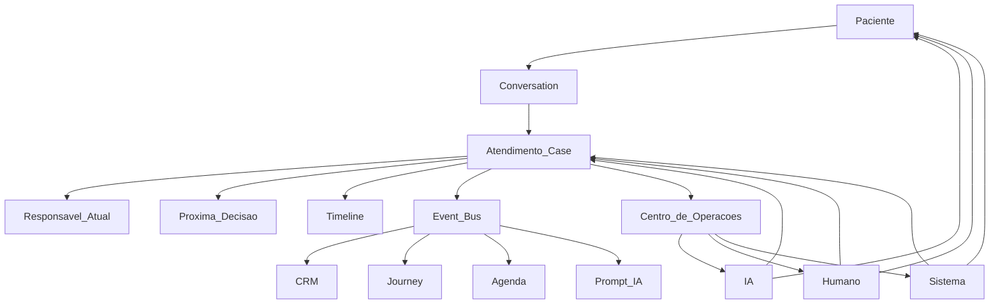

# 9. Arquitetura Operacional Alvo

Documento final da auditoria. Consolida Filosofia, Decision Map, Event Map e Case.

**Pergunta-guia em todo desenho:** Quem deveria tomar a próxima decisão?

---

## Visão

```text
Paciente
  → Conversation (canal)
  → Case (Atendimento)          ← fonte da verdade
       ├─ Responsável Atual
       ├─ Próxima decisão
       └─ Timeline
  → Event Bus
       → CRM / Journey / Agenda / SLA / Dashboards / Prompt IA
  → Centro de Operações
       → IA | Humano | Sistema
  → Paciente
```



---

## Princípios

1. **Um Case** = fonte da verdade operacional  
2. **Um Responsável Atual** = sempre definido  
3. **Uma próxima decisão** = explícita  
4. **Eventos** propagam consequências das decisões  
5. **Uma superfície de trabalho** = Centro de Operações  
6. Interfaces não mantêm realidades paralelas  
7. Constituição = [`08-filosofia-do-atendimento.md`](./08-filosofia-do-atendimento.md)

---

## Componentes

### 1. Case Store

Persistência do Atendimento (campos em `07-continuidade-e-case.md`).

**Mapeamento inicial sugerido (evolutivo, não big-bang):**

| Conceito Case | Bootstrapping a partir de |
|---------------|---------------------------|
| channel conversation | `whatsapp_conversations` |
| patient_id | já existe |
| pipeline_id | **novo** FK / backfill phone |
| owner | derivar de `ai_*` + `assigned_secretary_id` → depois campo nativo |
| pending_decision | unificar journey suggestedAction + lead next_action |
| timeline | msgs + ai events + pipeline history + message_events |
| briefs / notes | novo |

### 2. Decision Engine (leve)

Não precisa ser BPM pesado. API interna:

- `recordDecision(caseId, actor, decisionType, payload)`
- `setOwner(caseId, owner, brief?)`
- `setPendingDecision(caseId, decision | null)`
- `closeCase` / `reopenCase`

Valida transições contra Filosofia + Decision Map.

### 3. Event Bus

`emit(decisionId, eventType, payload)` → handlers:

| Handler | Efeito |
|---------|--------|
| `crmLifecycleHandler` | Atualiza `non_registered_pipeline` |
| `journeyInvalidateHandler` | Refresh/clear `ai_state` journey fields |
| `agendaHandler` | Já existe via services; passa a notificar Case |
| `whatsappTemplateHandler` | message-processor atual |
| `opsQueueHandler` | Atualiza facets do Centro de Operações |
| `promptContextHandler` | Materializa bloco contexto operacional |

Contrato de eventos: [`02-event-map.md`](./02-event-map.md).

### 4. Centro de Operações

UI única (wireflow em [`05-diagnostico-operacional.md`](./05-diagnostico-operacional.md)).

Reusa: chat WhatsApp, next-action card, assign/reactivate — sob o Case.

### 5. Atores

| Ator | Runtime hoje | Runtime alvo |
|------|--------------|--------------|
| IA | `process-inbound` + tools | Lê/escreve Case; respeita owner=`IA` |
| Humano | Inbox + CRM + agenda | Ops Center; claim; brief |
| Sistema | crons / timeout-executor | Owner=`Sistema`; lembretes first-class |

---

## Modelo de dados (alvo lógico)

```text
cases
  id, clinic_id, status, owner_type, owner_id,
  pipeline_id, patient_id, conversation_id,
  pending_decision jsonb, commercial_stage,
  sla_due_at, created_at, closed_at, ...

case_timeline_entries
  id, case_id, kind (decision|event|message_ref|brief),
  actor, payload, created_at

case_briefs
  id, case_id, from_owner, to_owner, body, created_at
```

Fase 0 de implementação pode ser **vista materializada / camada de domínio** sobre tabelas atuais antes de migration custom completa — desde que a API de Case seja a única porta.

---

## Backlog derivado (ordem)

Ordem correta pós-auditoria (não executar neste doc além de listar):

### P0 — Integridade do responsável (rupturas ativas)

1. Assign humano **sempre** pausa IA / seta handoff (bug atual).  
2. Send humano já pausa — alinhar assign ao mesmo protocolo.  
3. Expor Responsável Atual na UI WhatsApp (não só filtro IA/Humano ambíguo).

### P1 — Case mínimo + Event Bridge

1. `pipeline_id` na conversa + backfill.  
2. `recordDecision` / `emit` para: inbound bump, handoff, appointment_created, patient_registered, pipeline_stage_changed.  
3. Invalidar journey no `ai_state` quando CRM muda.  
4. Bloco prompt “Contexto operacional” (owner, brief, pending_decision, stage).

### P2 — Centro de Operações

1. Rota `/dashboard/operacoes` (ou evoluir WhatsApp full-width split).  
2. Filas por owner/SLA/pending_decision.  
3. Claim + devolver IA com brief.  
4. Deep-links bidirecionais Leads/Jornada ↔ Ops.

### P3 — Sistema como ator

1. “Me chama amanhã” → pending_decision + owner Sistema.  
2. Unificar next_action / suggestedAction.  
3. Idempotência `wamid` + statuses Meta (fidelidade do canal).

### P4 — Analytics separado

1. Pipeline CRM permanece analytics.  
2. Ops não compete com funis.

---

## O que não fazer

- Continuar adicionando telas operacionais paralelas.  
- Tratar WhatsApp+CRM como integrações laterais sem Case.  
- Deixar “próximo passo” sem dono.  
- Deixar a IA e o humano decidirem ao mesmo tempo.

---

## Critério de aceite da arquitetura

O time responde:

1. O que é um Case?  
2. Quem é o Responsável Atual?  
3. Quem deveria tomar a próxima decisão?  
4. Qual decisão/evento a feature nova toca?  
5. A Filosofia permite?  

Se alguma resposta falhar, a feature não está pronta.

---

## Relação com docs existentes

| Doc antigo | Papel após esta auditoria |
|------------|---------------------------|
| `PIPELINE-AGENTE-VIRTUAL-FLUXO-COMPLETO.md` | Runtime IA (stage/tools) — subconjunto do ator IA |
| `WHATSAPP-AUDITORIA-COBERTURA-E-FIDELIDADE.md` | Fidelidade canal/templates |
| `FLOWMEDI-VISAO-PRODUTO-E-ARQUITETURA.md` | Visão ampla; este pacote é o SO de Atendimento |
| `FLUXO-OPERACIONAL-*.md` | Histórico; Ops Center é o alvo unificador |

---

## Encerramento da auditoria

Esta pasta (`docs/sistema-operacional-atendimento/`) é o **documento ouro** do atendimento Flowmedi:

| Artefato | Arquivo |
|----------|---------|
| Constituição | `08-filosofia-do-atendimento.md` |
| Decision Map | `03-decision-map.md` |
| Event Map | `02-event-map.md` |
| Case + continuidade | `07-continuidade-e-case.md` |
| Arquitetura | este arquivo |
| Ops UX | `05-diagnostico-operacional.md` |

Implementação de código começa pelos itens **P0**, sob a constituição — não antes de violar a pergunta-guia.
